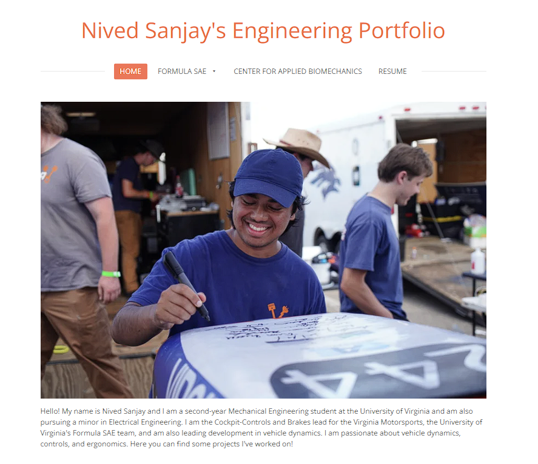
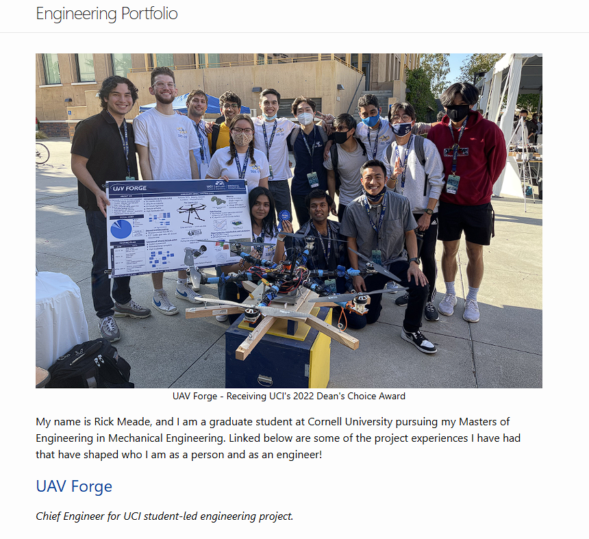
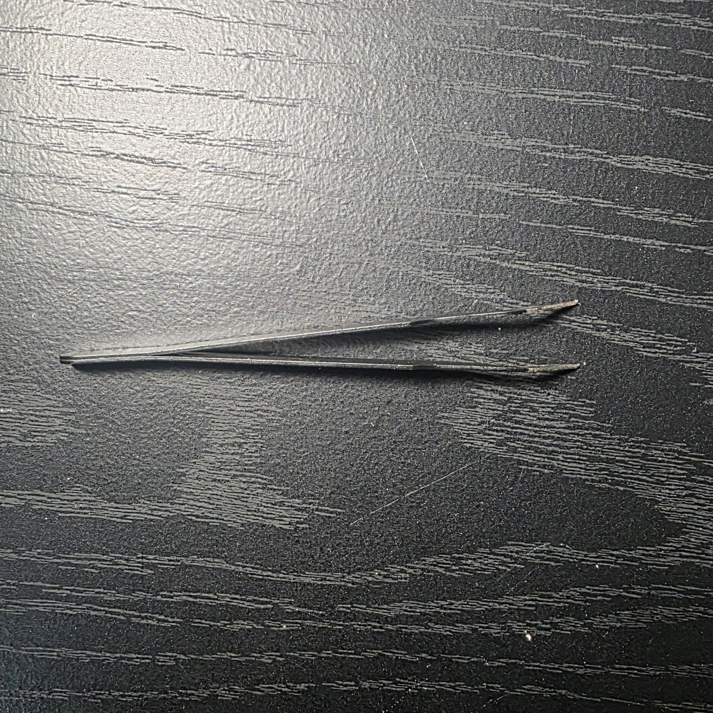
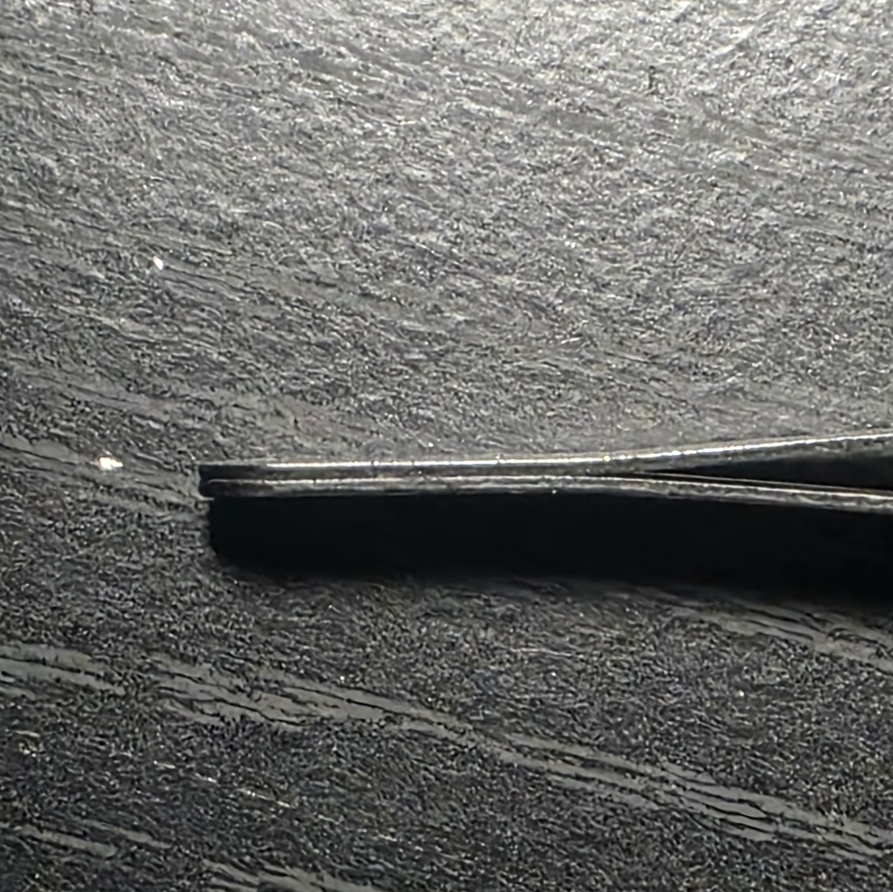
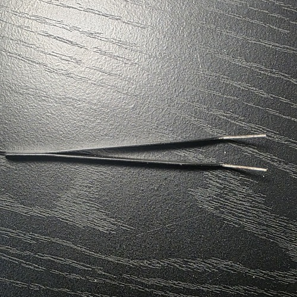
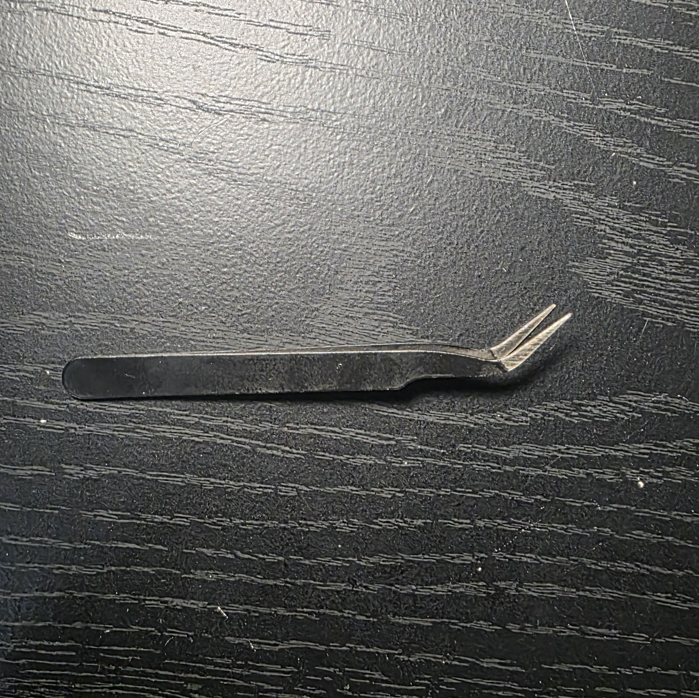
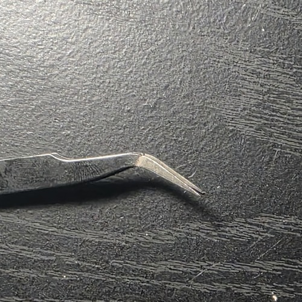
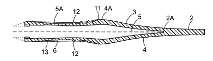

# A1 - Professional Portfolio

## Objective

Build a professional engineering portfolio that documents my analysis, design decisions, and engineering work in a format that can be reviewed by instructors, other engineers, and potential employers.

## Analyze

## Task A: Portfolio Analysis

### Portfolio 1 — Nived Sanjay

**Portfolio:** [Nived Sanjay's Engineering Portfolio](https://www.nived-sanjay.com/)

#### Navigability

Nived Sanjay's portfolio is organized into four main sections: **Home, FSAE, Center for Applied Biomechanics, and Resume**. I found the organization easy to navigate because the major areas of his engineering experience are separated instead of being placed on one long page. A visitor could locate a particular type of work in under 60 seconds. I especially like the dedicated Resume section because an employer can move from looking at his engineering projects to seeing his education, experience, and technical skills without leaving the portfolio.

#### Reproducibility

The projects provide a substantial amount of technical information. For example, the Blade Anti-Roll Bar Design includes design inputs, calculations, material selections, FEA results, and final system parameters. He identifies materials such as 4130 steel and Ti-6Al-4V and explains how they were incorporated into the design. Another engineer could understand how the system was developed, but exact reproduction would still require additional information such as complete CAD files, engineering drawings, dimensions, and manufacturing specifications.

#### Evidence of Reasoning

This is one of the strongest parts of the portfolio. Nived does not only show the final product; he explains the engineering decisions that led to it. His anti-roll-bar design discusses trade-offs between **stiffness, adjustment resolution, adjustment range, and weight**, and then uses FEA and calculated performance values to evaluate the resulting design. This allows the reader to understand why design decisions were made instead of only seeing the final result.

#### Professional Tone

I think Nived presents himself effectively from an employer's perspective because his technical projects are supported by a dedicated resume. His resume includes engineering experience with **Hexagon Manufacturing Intelligence, UVA Motorsports Formula SAE, and the Center for Applied Biomechanics**, along with his education and technical skills. This was something I specifically liked because the portfolio shows not only what he has designed but also where he has applied his engineering skills.

---

### Portfolio 2 — Rick Meade

**Portfolio:** [Rick Meade's Engineering Portfolio](https://rjmeade.github.io/)

#### Navigability

Rick Meade's portfolio has a much more basic layout, but I found it easy to navigate. His projects are presented directly on the homepage as individual links with short descriptions explaining what each project involves. This makes it possible to quickly choose between projects involving UAVs, computer vision, path planning, ground vehicles, aircraft, and robotics. I think this approach works well with the current number of projects, although additional navigation or categories could help if the portfolio becomes larger.

#### Reproducibility

Reproducibility is the main area where I think Rick's portfolio could improve. His UAV Forge project provides requirements, motor comparisons, flight-time estimates, graphs, testing procedures, and other technical information. This gives another engineer a strong understanding of the project, but I do not think the UAV could be completely reproduced using the portfolio alone. Additional CAD files, drawings, dimensions, wiring information, code, and a bill of materials would make the project substantially more reproducible.

#### Evidence of Reasoning

I think Rick's ability to defend his engineering decisions is the strongest part of his portfolio. One example is his analysis of using larger propellers. His analysis indicated approximately a **30% improvement in thrust per amp**, but implementing the larger propellers would have required significant structural modifications. Because the existing configuration already met the requirements, the team decided against redesigning the structure. I liked this because he does not simply state what was selected; he provides evidence explaining **why** the decision made sense.

#### Professional Tone

Although Rick's website is visually basic compared with Nived's, I think the engineering content presents him as a capable engineer. His use of requirements, calculations, trade studies, and structured testing supports the decisions he presents. He also provides his name, engineering field, email, and a short statement about himself. However, I would improve the portfolio by adding a more visible **Resume or Experience section**. This would allow an employer to connect his strong project work with his education, internships, employment, and other engineering experience more easily.

### Overall Takeaway

The main feature I would take from **Nived's portfolio** is the organization of projects, experience, and resume information. From **Rick's portfolio**, I would take the emphasis on supporting engineering decisions with calculations, trade-offs, and testing. For my own portfolio, I want to combine these approaches while improving reproducibility by providing enough technical documentation for another engineer to understand how my work could be recreated.

---

## Task B: Product Analysis

### Product — Angled Precision Tweezers

For this product analysis, I selected a pair of angled precision tweezers. The tweezers are made from two thin metal arms permanently joined at one end. The geometry of the arms allows the tweezers to behave like a spring while also providing the gripping motion needed to manipulate small objects.

### Primary Mechanical Function

The primary mechanical function of the tweezers is to convert an applied finger force into a controlled gripping force at the tips.

When the user squeezes the two arms, the arms elastically bend inward and the distance between the tips decreases. The tips eventually contact the object being manipulated and apply a gripping force to it. When the user releases the tweezers, the elastic behavior of the metal causes the arms to return toward their original open position.

This allows the same structure to provide both the motion and restoring force without requiring a separate hinge or spring.

### Governing Model

The mechanical behavior of each tweezer arm can be approximated as a cantilever beam undergoing bending.

A simplified relationship for the deflection of a cantilever beam is:

**δ = FL³ / 3EI**

Where:

- **δ** = deflection of the tweezer arm
- **F** = force applied by the user's fingers
- **L** = effective length of the flexible arm
- **E** = Young's modulus of the material
- **I** = second moment of area of the arm cross-section

The equation shows that the amount of movement at the tip depends on both the material and geometry of the tweezer. Increasing the applied force or effective arm length increases deflection, while increasing the material stiffness or second moment of area decreases deflection.

For the tweezers to work properly, the arms must be flexible enough to move when squeezed while remaining stiff enough to provide a useful gripping force.

#### Assumption

For this simplified model, each arm is assumed to behave approximately as a cantilever beam experiencing small elastic deflection. The material is assumed to remain below its yield strength during normal use. Therefore, when the applied finger force is removed, the arms return approximately to their original shape.

### Component Geometry and Mechanical Function

The geometry of the tweezers can be divided into four important functional areas: the **joined base, flexible arms, angled neck, and precision tips**.

#### Joined Base

The two metal arms are permanently joined at the rear of the tweezers. This connection acts approximately as the fixed end of the flexible structure.

Because the two arms are constrained at this end, applying force farther along the arms causes them to bend inward. The rounded shape of the rear also eliminates sharp external corners in an area that may contact the user's hand.

#### Flexible Arms and Finger-Grip Region

The majority of the tweezers consists of two long, thin, and relatively flat metal arms. The arms gradually separate from the joined base, leaving an open space between them when no force is being applied.

The long and thin geometry allows the arms to elastically bend when squeezed. The relatively wide middle portion also provides a larger surface where the user's fingers can apply force.

This section performs much of the spring function of the tweezers. When the user releases the applied force, the elastic deformation of the arms causes them to move back toward their original position.

#### Angled Neck

Near the working end, both arms contain a noticeable bend. This changes the direction of the gripping tips relative to the main body of the tweezers.

The angled geometry allows the user to approach a small object while keeping the larger body of the tweezers and the user's fingers farther away from the immediate working area. This can improve visibility and access when manipulating small components.

#### Precision Tips

After the angled section, the arms narrow significantly into small precision tips.

When the arms are squeezed, the two tips move toward each other until they contact the object being manipulated. Their narrow geometry provides a small contact region, allowing objects much smaller than the width of the main tweezer body to be manipulated.

### Relationship Between Geometry and Function

The geometry of the tweezers allows a relatively simple assembly to perform several mechanical functions without a separate hinge or coil spring.

The **joined base** constrains the structure, the **long thin arms** provide elastic flexibility, the **angled neck** positions the working end, and the **narrow tips** provide precise contact with small objects.

Together, these features allow finger force applied over a relatively large area of the tweezer body to create controlled motion and gripping force at a much smaller working area.

### Patent Research

**Patent Publication Number:** US20060175853A1

**Patent Title:** *Tweezer*

**Patent:** [US20060175853A1 — Google Patents](https://patents.google.com/patent/US20060175853A1/en)

#### Inventors

The inventors listed on the patent are:

- Paul Anderson
- Lisa Baumgarten
- Antonette Bivona
- John Butcher
- Ingrid Chen
- Emily Cohen
- Jeffery Feng
- Stacey Grabiner
- David Kusch
- Jayne Lynch
- Bryce Rutter
- Heather Sopczynski

The patent describes a tweezer with two arms extending from a common base. The user applies force to the arms, causing the tips to move toward each other and grip an object. The patent focuses on improving the shape of the arms and gripping areas to make the tweezers easier to hold and control.

### Alternative Solutions

Two alternative products that can perform a similar gripping function are **needle-nose pliers** and **forceps**.

#### Needle-Nose Pliers

Needle-nose pliers use two rigid jaws connected through a mechanical pivot. When force is applied to the handles, the jaws rotate toward each other and grip an object.

Unlike the tweezers, which primarily use elastic bending of their arms, needle-nose pliers use rotational motion around a pivot. They can provide greater gripping force but are generally larger and less suitable for extremely small precision work.

#### Forceps

Forceps also use opposing arms or jaws to grip and manipulate objects. They are commonly used for medical, laboratory, and other precision applications.

Some forceps operate similarly to tweezers by using flexible arms, while other designs use hinges or locking mechanisms. They provide another solution to the same general problem of manipulating an object that may be too small or difficult to handle directly with the user's fingers.

### Design Decision from the Patent

One design decision described in the patent is the geometry of the tweezer arms. The patent describes arms that first diverge outward from the base and then converge toward the centerline near the working end. It also describes features such as finger-grip depressions and a slanted tip.

I think these features were selected to improve how the user holds and controls the tweezers. Changing the geometry of the arms changes the area where the user's fingers contact the tool while still allowing the arms to elastically move toward each other.

The slanted tip is particularly relevant to the tweezers I analyzed because my tweezers also use an angled working end. The angled geometry allows the gripping point to be offset from the main body of the tool, which can improve access and visibility when working with small objects.

Although my tweezers are not identical to the design shown in the patent, both use the geometry of the arms and tips to improve the user's ability to grip and manipulate small objects.

---

## Decide

### Homepage Identity

My portfolio is designed primarily for potential engineering employers while also serving as a personal record of my academic and independent engineering projects. Because an employer may only spend a limited amount of time reviewing the site, the homepage should immediately identify the site as an engineering portfolio and provide direct access to my projects and coursework. The navigation will separate course assignments from other engineering projects so that a visitor can quickly locate the type of work they are interested in. The homepage will also establish that the work shown throughout the portfolio documents not only final results, but also the analysis, design decisions, and reasoning that led to them. My personal background will remain in the About Me section so that the homepage can focus on helping a visitor understand what the portfolio contains and how to navigate it.

### Intentional Customization

I made two intentional changes to the original portfolio template: I changed the primary color from green to indigo and added descriptive titles to the assignment navigation. Instead of displaying assignments only as A1, A2, A3, and so on, the navigation now includes the assignment number and its topic, such as “A2: Truss Stress Analysis” and “A4: Motor Mount.” This change improves navigability because a visitor can identify the subject of an assignment before opening the page rather than searching through multiple pages to find a specific project. I also changed the default green color to indigo to give the portfolio a distinct visual identity while maintaining the simple layout and readability of the original template. These changes preserve the course's existing organization while making the portfolio easier to navigate and more identifiable as my own.

### Documentation Standard

For every assignment in this portfolio, I will document my engineering work so that another engineer can reproduce my process and understand the reasoning behind my design decisions without needing additional explanation.

## Communicate

## What Does It Mean to Defend an Engineering Decision?

To me, defending an engineering decision means being able to explain why I believe a decision is worth making and why I am willing to stand behind it. My first consideration is safety. If a design can accomplish its purpose without creating unnecessary risk to people, then I am more comfortable defending that choice. On a larger scale, I also believe an engineering decision is worth defending when it can provide a meaningful benefit to people or society.

At this point, I understand these principles, but I do not think I fully know how to defend an engineering decision from a technical standpoint yet. I can explain why I believe an idea makes sense based on my experience, but I still need to improve at supporting those decisions with calculations, requirements, evidence, and comparisons between alternatives. I expect this course to help me develop that ability so that I can defend a decision based not only on what I believe is right, but also on engineering reasoning that another person can evaluate.

---

### Professional Introduction

My professional introduction and engineering background are available in the About Me section of this portfolio.

[View About Me](../../aboutme/)
