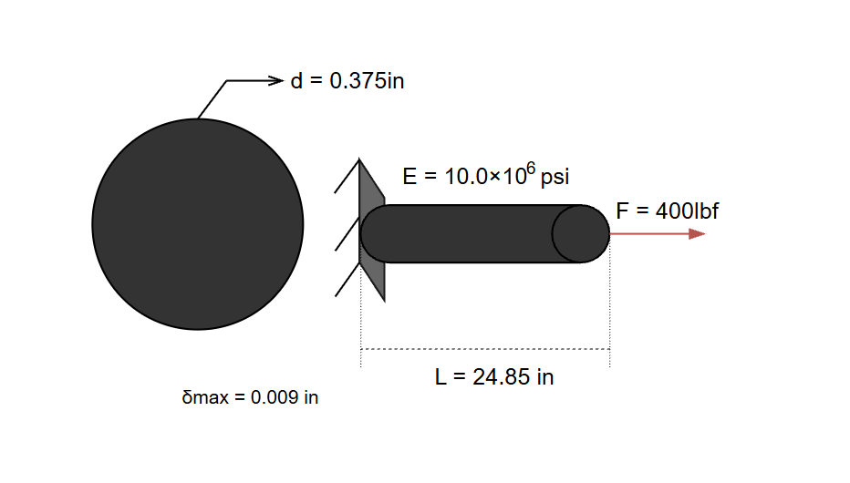
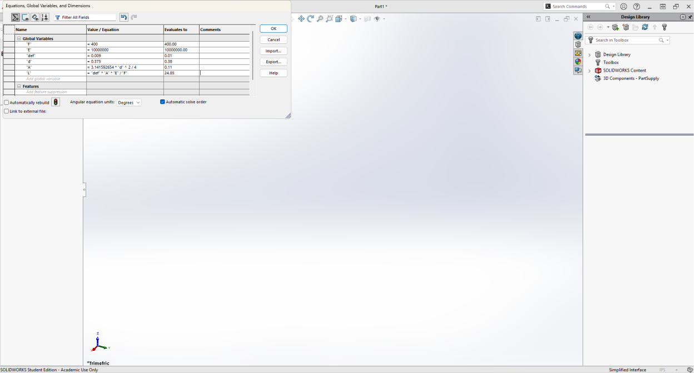
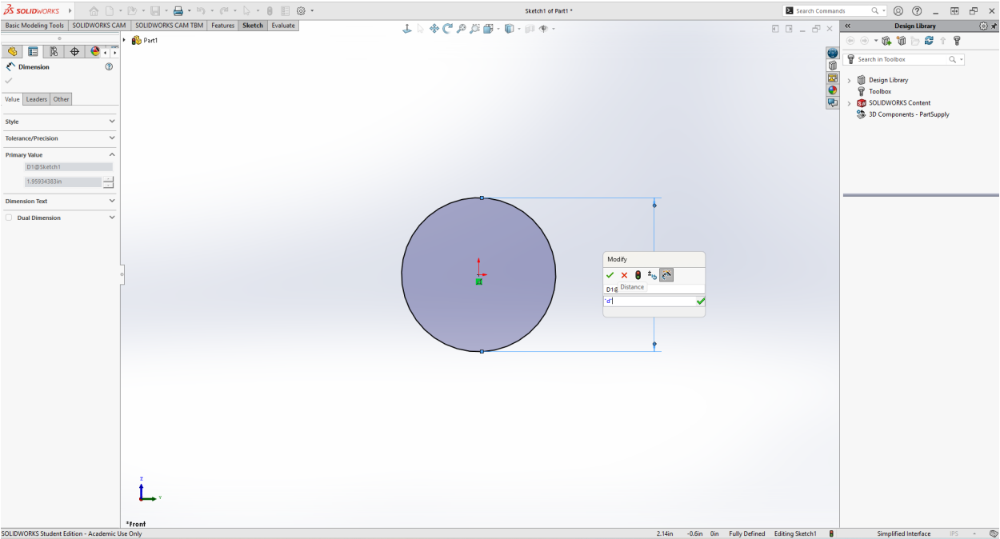
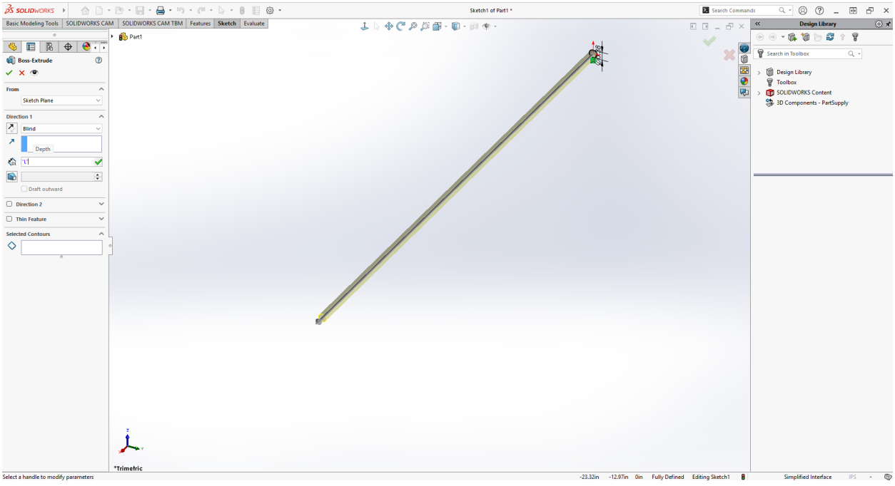
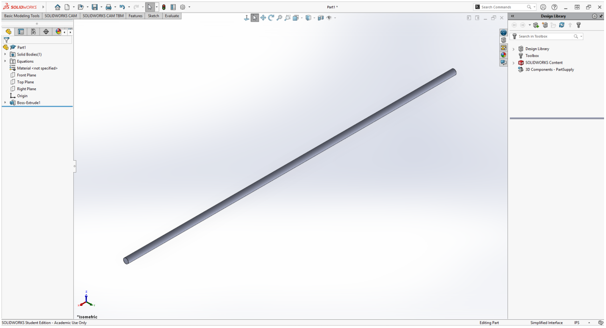

# A2 – Truss Stress Analysis

## Objective

The objective of this assignment was to design a lightweight planar truss and determine the required member and pin sizes using basic stress equations. I used statics to calculate the support reactions and internal member forces, then used the largest calculated force to size the common truss-member cross-section. The final design was modeled in SolidWorks so the CAD mass could be compared with the analytical mass.

> **Figure #1 — Assignment constraints**

---

## Analyze

The first part of the assignment was to determine the forces acting through the truss before choosing the final member and pin sizes. I used the given geometry, a selected load of 25 kN, equilibrium equations, and the method of joints. These results were then used to determine the minimum cross-sectional area required for the truss members and the minimum diameter required for the pins.

### Truss Geometry

The final design uses:

- **P = 25 kN**
- **a = 0.4 m**
- **b = 0.3 m**
- **A = pin support**
- **B = roller support**

The five joints are **A, B, C, D, and E**.

The seven truss members are:

**BE, EA, BC, CE, ED, AD, and CD**

The final member lengths are:

| Member | Length |
|---|---:|
| BE | 0.600 m |
| EA | 0.600 m |
| BC | 0.500 m |
| AD | 0.500 m |
| CE | 0.3606 m |
| ED | 0.3606 m |
| CD | 0.400 m |

The total centerline length of the seven members is approximately:

**Ltotal = 3.3211 m**

> **Figure #2 — Final truss geometry dimensions with a = 0.4 m and b = 0.3 m**

### Free-Body Diagrams

The overall free-body diagram shows the two applied loads and the support reactions at A and B. At joint A, the unknown support reactions are Ax and Ay, while the roller at B has the reaction By. The reaction arrows were initially assumed before solving, so a negative calculated result means the true force acts in the opposite direction.

Separate free-body diagrams were also made for joints A, B, C, D, and E. When solving the joints, the unknown member-force arrows were initially assumed to be in tension and were drawn away from the joint. A negative result therefore indicates compression.

> **Figure #3 — Overall truss free-body diagram**

> **Figure #4 — Joint A and Joint B free-body diagrams**

> **Figure #5 — Joint C, Joint D, and Joint E free-body diagrams**

### Support Reactions

Taking moments about B:

**ΣMB = 0**

**Ay(3a) + P(a) - P(2a) = 0**

**Ay = P / 3**

**Ay = 8.333 kN**

Using vertical equilibrium:

**ΣFy = 0**

**Ay + By + P - P = 0**

**By = -8.333 kN**

The negative sign means the actual reaction at B acts downward relative to the initially assumed upward direction.

Using horizontal equilibrium:

**ΣFx = 0**

**Ax = 0**

### Member Forces

The method of joints was used to solve the force in every truss member.

| Member | Force | Result |
|---|---:|---|
| BE | 11.111 kN | Tension |
| EA | -11.111 kN | Compression |
| BC | -13.889 kN | Compression |
| CE | -20.031 kN | Compression |
| ED | 20.031 kN | Tension |
| AD | 13.889 kN | Tension |
| CD | 0 kN | Zero-force member |

The largest internal-force magnitude is:

**Fmax = 20.031 kN**

This occurs in members CE and ED. Because every member must use the same cross-sectional area, this maximum value was used to size the truss.

> **Figure #6 — Symbolic and numerical truss calculations from Overleaf**

### Material Selection

The truss was modeled using **ASTM A500 Grade C** material properties. The values used for the calculations and custom SolidWorks material were:

- **Yield strength = 345 MPa**
- **Ultimate tensile strength = 425 MPa**
- **Elastic modulus = 200,000 MPa**
- **Poisson's ratio = 0.29**
- **Density = 7800 kg/m3**

Material-property source:

[BeamDimensions - ASTM A500](https://beamdimensions.com/materials/Steel/ASTM/ASTM_A500/)

> **Figure #7 — ASTM A500 Grade C material-property source**

> **Figure #8 — Custom ASTM A500 Grade C material in SolidWorks**

### Member Cross-Section

The required member safety factor is:

**FSmember = 3.5**

The allowable normal stress is:

**σallow = Sy / FS**

**σallow = 345 / 3.5 = 98.57 MPa**

The minimum required member area is:

**Amin = (Fmax × FS) / Sy**

**Amin = (20,030.84 N × 3.5) / 345 N/mm2**

**Amin = 203.21 mm2**

I selected a **15 mm × 15 mm** solid cross-section:

**Amember = 15 × 15 = 225 mm2**

Because:

**225 mm2 > 203.21 mm2**

the selected cross-section satisfies the required area.

The actual maximum normal stress is:

**σmax = 20,030.84 / 225 = 89.03 MPa**

The actual member safety factor is:

**FSactual = 345 / 89.03 = 3.88**

Since **3.88 > 3.5**, the selected member cross-section satisfies the required safety factor.

> **Figure #9 — Member-area and safety-factor calculations**

### Pin Design

The assignment specifies hardened tool-steel pins with:

- **Yield shear strength = 170 ksi = 1172.11 MPa**
- **Density = 0.278 lb/in3**
- **Required pin safety factor = 4**
- **Single-shear connection**

The critical pin load used for the design is:

**Fpin = 25 kN**

For a single-shear pin:

**Apin,min = (Fpin × FSpin) / Ssy**

**Apin,min = (25,000 × 4) / 1172.11**

**Apin,min = 85.32 mm2**

For a circular pin:

**A = πd² / 4**

Solving for diameter gives:

**dmin = 10.42 mm**

I selected:

**Pin diameter = 11 mm**

The actual area of the 11 mm pin is:

**Apin = 95.03 mm2**

The actual average shear stress is:

**τ = 25,000 / 95.03 = 263.07 MPa**

The actual pin safety factor is:

**FSpin,actual = 1172.11 / 263.07 = 4.46**

Since **4.46 > 4**, the selected 11 mm pin satisfies the required safety factor.

The final flat truss body is 15 mm thick, so the final pin was modeled as:

- **Diameter = 11 mm**
- **Length = 15 mm**

> **Figure #10 — Critical-pin free-body diagram**

> **Figure #11 — Pin sizing calculations**

### Pin Joint Geometry

The pin holes remove material from the member at each joint, so the joint areas were widened in the final CAD model. A 26 mm circular joint region was used around each 11 mm hole so that the net section across the center of the hole remained at least as large as the selected 225 mm2 member area.

Using the 15 mm truss thickness:

**Anet = (Djoint - dhole) × t**

**225 = (Djoint - 11) × 15**

**Djoint = 26 mm**

The final joint geometry therefore uses:

- **Joint-pad diameter = 26 mm**
- **Hole diameter = 11 mm**
- **Truss thickness = 15 mm**

> **Figure #12 — 26 mm joint pads and 11 mm pin holes**

### Analytical Mass Estimate

Using the selected 225 mm2 cross-sectional area and the total centerline member length:

**Vtruss ≈ A × Ltotal**

**Vtruss ≈ (225 × 10-6)(3.3211)**

**Vtruss ≈ 7.4725 × 10-4 m3**

Using the A500 Grade C density:

**mtruss,calc ≈ 5.82855 kg**

The calculated mass of one 11 mm diameter, 15 mm long pin is approximately:

**mone pin,calc ≈ 0.01097 kg**

For five pins:

**mpins,calc ≈ 0.05485 kg**

The final analytical estimate is:

**mtotal,calc ≈ 5.8834 kg**

---

## Decide

The final design was selected based on the calculated member and pin requirements rather than only on appearance. The 15 mm × 15 mm member section exceeds the minimum required area, and the 11 mm pin exceeds the minimum required pin diameter. The design was then recreated in SolidWorks as a flat one-part truss body with five separate identical pins.

### Final Design

| Item | Final Value |
|---|---:|
| Applied load P | 25 kN |
| a | 0.4 m |
| b | 0.3 m |
| Member size | 15 mm × 15 mm |
| Member area | 225 mm2 |
| Truss thickness | 15 mm |
| Joint-pad diameter | 26 mm |
| Pin-hole diameter | 11 mm |
| Pin diameter | 11 mm |
| Pin length | 15 mm |
| Number of pins | 5 |

### CAD Process

The truss was modeled in SolidWorks using MMGS units. I first created construction geometry and located the five joint centers using the correct 400 mm, 600 mm, and 300 mm dimensions. I connected the joint centers, offset the member centerlines by 7.5 mm on each side, converted the original centerlines to construction geometry, and cleaned the intersections until the profile was fully defined.

The completed truss profile was extruded to 15 mm. The five 26 mm joint pads were then added, followed by the five 11 mm pin holes. Finally, one 11 mm diameter by 15 mm long pin was modeled and inserted five times into the final assembly.

> **Figure #13 — Construction lines and joint locations**

> **Figure #14 — Seven-member centerline skeleton**

> **Figure #15 — 7.5 mm offset used on both sides of each member**

> **Figure #16 — Centerlines converted to construction geometry**

> **Figure #17 — Trimmed and cleaned joint geometry**

> **Figure #18 — Fully defined final truss sketch**

> **Figure #19 — Truss extruded to 15 mm**

> **Figure #20 — Final truss body with joint pads and holes**

> **Figure #21 — 11 mm × 15 mm pin model**

> **Figure #22 — Final SolidWorks assembly with five pins**

### CAD Mass Results

The SolidWorks mass of the final truss body was:

**mCAD,truss = 5.77144 kg**

The SolidWorks mass of one pin was:

**mCAD,pin = 11.12 g**

The final SolidWorks assembly containing the truss and all five pins had a mass of:

**mCAD,total = 5.82704 kg**

> **Figure #23 — Truss-body mass properties - 5771.44 g**

> **Figure #24 — One-pin mass properties - 11.12 g**

> **Figure #25 — Final assembly mass properties - 5827.04 g**

### Weight Comparison

The analytical total mass was:

**mcalc = 5.8834 kg**

The SolidWorks assembly mass was:

**mCAD = 5.82704 kg**

The absolute difference is:

**Difference = 0.05636 kg**

The percent difference is approximately:

**Percent difference = 0.96%**

The two results are very close. The analytical calculation treats the members using simplified centerline lengths and constant area, while the CAD model includes the actual trimmed joints, circular joint pads, holes, arcs, and merged geometry. This explains why the final CAD mass is slightly different from the analytical estimate.

---

## Communicate

The completed analysis showed that the selected member and pin dimensions satisfy the required safety factors for the simplified design model. The CAD model also produced a mass within about one percent of the analytical estimate, which shows that the analytical model and final geometry are reasonably consistent. The failure-mode review also showed that a member can be safe against simple axial yielding while still having other possible failure concerns such as buckling in compression.

### MEGR 2157 – Truss Member Failure Modes

ASTM A500 Grade C is treated as a ductile steel. For the tension members, yielding is expected before tensile fracture because the yield strength used in the design is lower than the ultimate tensile strength. For compression members, buckling becomes an important possible failure mode when the assignment's simplified no-buckling assumption is removed.

For the 15 mm × 15 mm solid section:

**I = bh³ / 12 = 4218.75 mm4**

Using the ideal pinned-column Euler relation:

**Pcr = π²EI / L²**

the failure-mode screening gives the following results:

| Member | Loading | Stress | Expected Failure Mode | Material Behavior | Possible Improvement |
|---|---|---:|---|---|---|
| BE | Tension | 49.38 MPa | Yielding before fracture | Ductile | Increase common member area |
| EA | Compression | 49.38 MPa | Buckling | Ductile material | Increase moment of inertia or reduce unsupported length |
| BC | Compression | 61.73 MPa | Buckling | Ductile material | Increase moment of inertia or reduce unsupported length |
| CE | Compression | 89.03 MPa | Buckling | Ductile material | Increase moment of inertia |
| ED | Tension | 89.03 MPa | Yielding before fracture | Ductile | Increase common member area |
| AD | Tension | 61.73 MPa | Yielding before fracture | Ductile | Increase common member area |
| CD | Zero force | 0 MPa | None under this ideal load case | Ductile | Retain for stability and other possible load cases |

The main sizing portion of the assignment specifically allowed compression-member buckling to be ignored. The table above is a separate MEGR 2157 failure-mode review and does not replace the required basic-stress sizing calculation.

> **Figure #26 — Truss-member failure-mode analysis**

### MEGR 2157 – Pin Failure Mode

The pin was designed for direct single shear. At the critical 25 kN load, the 11 mm diameter pin has an average shear stress of approximately **263.07 MPa**, compared with the specified shear yield strength of **1172.11 MPa**. The resulting safety factor is **4.46**, so shear yielding is not expected at the design load.

If the applied load were increased enough, the most directly applicable failure mode for this pin design would be shear yielding across the single shear plane. Increasing the pin diameter would increase its shear area and reduce the average shear stress. A double-shear connection could also reduce the load carried by each shear plane, but this assignment specifically requires a single-shear connection.

> **Figure #27 — Pin failure-mode analysis**

### Engineering Lessons Learned

One of the biggest lessons from this assignment was that checking the original dimensions before beginning detailed CAD work is extremely important. The truss can have the correct shape and force ratios while still having completely incorrect member lengths and weight if the scale is wrong. I also learned that the joint design matters because adding a pin hole removes material from the member and can reduce the net cross-sectional area.

The comparison between analytical mass and CAD mass also showed why both methods are useful. The calculations provide a fast estimate and help size the structure, while CAD represents the final geometry more accurately. Having only about a 0.96% difference between the two results gave me confidence that the final corrected model was consistent with the calculations.

### Mistakes and Improvements

My largest mistake was initially reading the assignment dimensions as **a = 4 m** and **b = 3 m** instead of **a = 0.4 m** and **b = 0.3 m**. I completed most of the first CAD model before catching the error and then rebuilt the truss using the correct 400 mm and 300 mm dimensions. Because the corrected design is a uniform scale change, the truss angles and internal-force results remained the same, but all member lengths and weight calculations had to be corrected.

If I repeated the assignment, I would write the problem constraints and units in a short table before starting the calculations or CAD model. I would also check the overall span and height immediately after creating the first SolidWorks sketch. This would prevent a dimension-reading mistake from carrying through the rest of the design.

> **Figure #28 — Incorrect first CAD model at the wrong scale**

> **Figure #29 — Corrected final CAD model**

### Time Spent

**Total Time Spent: [ENTER ACTUAL TOTAL TIME]**

The assignment included calculations, CAD modeling, a complete CAD rebuild after correcting the dimensions, pin modeling, material setup, assembly work, mass-property comparison, failure-mode analysis, and documentation.

---

## CAD Download

**[ADD FINAL CAD DOWNLOAD LINK HERE]**

The final download should include the truss part, pin part, and assembly so the model can be reviewed and reproduced.

---

## References

1. BeamDimensions. **ASTM A500 Steel Material Properties.**  
   <https://beamdimensions.com/materials/Steel/ASTM/ASTM_A500/>

2. Steel Tube Institute. **ASTM A500.**  
   <https://steeltubeinstitute.org/resources/astm-a500/>

3. Purdue University, ME 323 Mechanics of Materials. **Lecture 39 – Buckling of Columns.**  
   <https://web.ics.purdue.edu/~gonza226/ME323/Lecture-39.pdf>

4. Purdue University, ME 323 Mechanics of Materials. **Lecture 3 – Shear Stress and Strain.**  
   <https://web.ics.purdue.edu/~gonza226/ME323/Lecture-03.pdf>

5. Course handout. **Shear on a Pin.**
