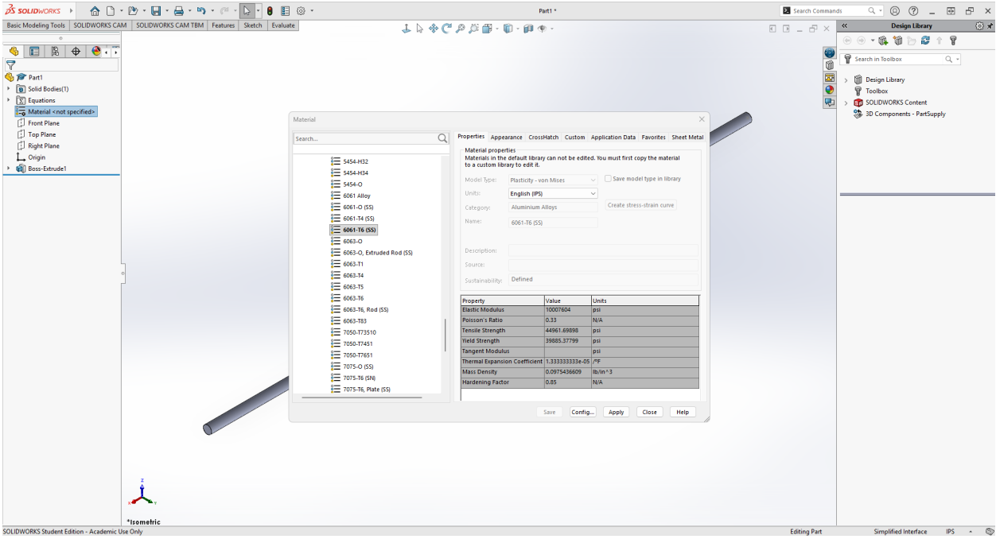
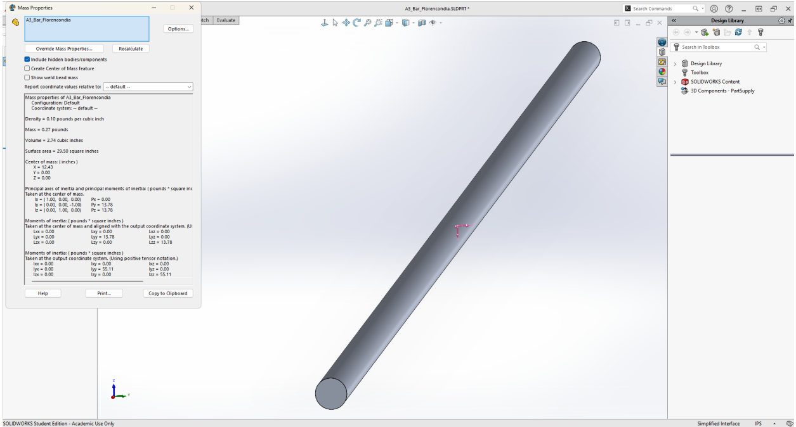
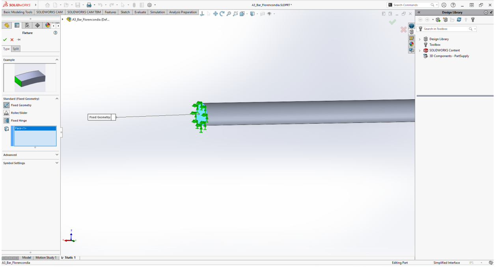
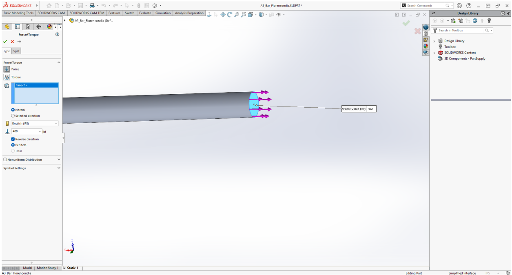
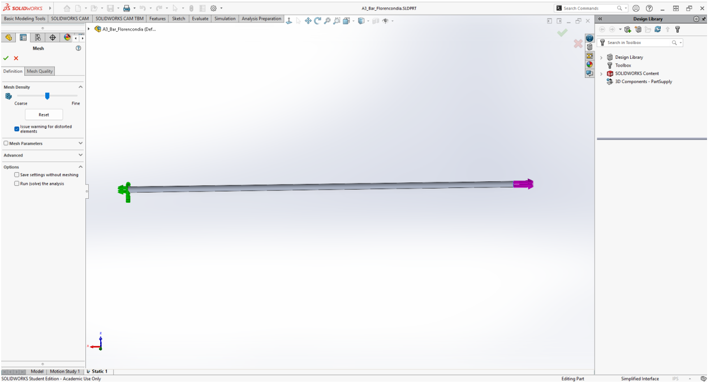
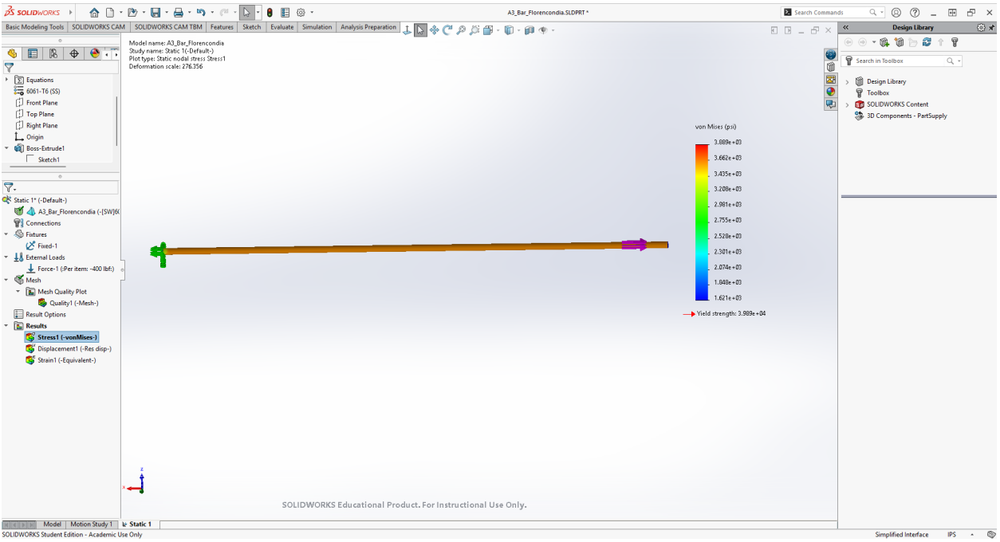
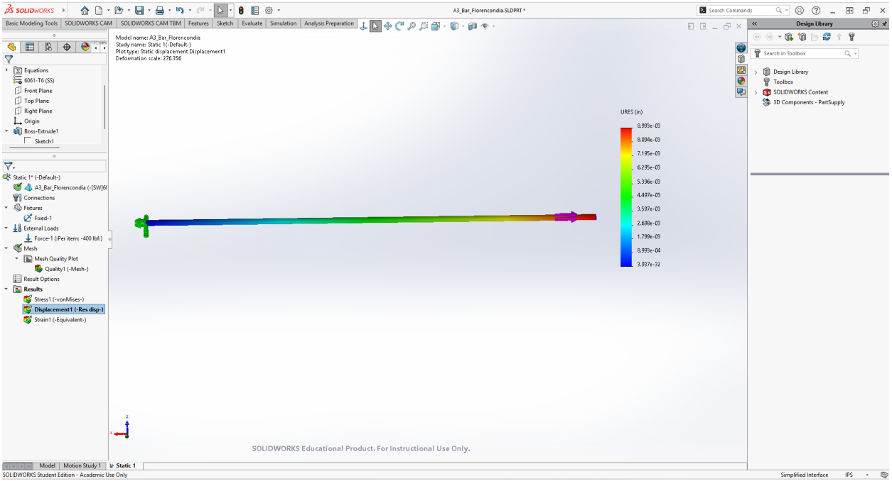

# A3 – Parametric and FEA

## Objective

The purpose of this assignment is to design an aluminum bar using parametric modeling and Finite Element Analysis (FEA). The bar must satisfy the required axial deflection limit while being subjected to a direct tensile load.

The design requirements are:

- Applied load between **300 lbf and 500 lbf**
- Maximum axial deflection of **0.009 in**
- Aluminum material
- Young's Modulus between **8.5 × 10^6 psi and 11.5 × 10^6 psi**
- Maximum stress below the specified aluminum yield strength of **40 ksi**

For my design, I chose a **solid circular aluminum bar**. The diameter was selected first and the required length was calculated from the maximum allowable axial deflection.

> **Figure #1 — Initial circular bar design and loading conditions**

---

## Analyze

### Design Requirements

$$300\text{ lbf}<F<500\text{ lbf}$$

$$\delta_{\max}=0.009\text{ in}$$

$$8.5\times10^6\text{ psi}<E<11.5\times10^6\text{ psi}$$

$$S_y=40,000\text{ psi}$$

### Selected Design Parameters

| Parameter | Symbol | Value |
| --- | --- | ---: |
| Applied Load | $F$ | 400 lbf |
| Young's Modulus | $E$ | $10.0\times10^6$ psi |
| Maximum Deflection | $\delta$ | 0.009 in |
| Diameter | $d$ | 0.375 in |
| Yield Strength | $S_y$ | 40,000 psi |

### Calculations

#### Cross-Sectional Area

$$d=0.375\text{ in}$$

$$A=\frac{\pi d^2}{4}$$

$$A=\frac{\pi(0.375)^2}{4}$$

$$\boxed{A=0.11045\text{ in}^2}$$

#### Bar Length

$$\delta=\frac{FL}{AE}$$

$$L=\frac{\delta AE}{F}$$

$$L=\frac{(0.009)(0.1104466)(10.0\times10^6)}{400}$$

$$L=24.8505\text{ in}$$

$$\boxed{L\approx24.85\text{ in}}$$

#### Parametric Length Equation

$$A=\frac{\pi d^2}{4}$$

$$L=\frac{\delta AE}{F}$$

$$L=\frac{\delta E}{F}\left(\frac{\pi d^2}{4}\right)$$

$$\boxed{L=\frac{\delta E\pi d^2}{4F}}$$

#### Axial Stress

$$\sigma=\frac{F}{A}$$

$$\sigma=\frac{400}{0.1104466}$$

$$\sigma=3621.7\text{ psi}$$

$$\boxed{\sigma=3.622\text{ ksi}}$$

#### Preliminary Safety Factor

$$FS=\frac{S_y}{\sigma}$$

$$FS=\frac{40,000}{3621.7}$$

$$\boxed{FS=11.04}$$

#### Volume

$$V=AL$$

$$V=(0.1104466)(24.8505)$$

$$\boxed{V=2.7447\text{ in}^3}$$

#### Estimated Weight

Using the density of Aluminum 6061-T6:

$$\rho\approx0.09754\text{ lb/in}^3$$

$$W=\rho V$$

$$W=(0.09754)(2.7447)$$

$$\boxed{W\approx0.268\text{ lb}}$$

---

## Decide

### Parametric SolidWorks Model

The bar was created in SolidWorks using global variables and equations so the geometry could update parametrically instead of using unrelated fixed dimensions.

The main global variables were:

$$F=400$$

$$E=10,000,000$$

$$\delta=0.009$$

$$d=0.375$$

The cross-sectional area was controlled by:

$$A=\frac{\pi d^2}{4}$$

The bar length was controlled by:

$$L=\frac{\delta AE}{F}$$

SolidWorks evaluated the design to approximately:

$$A=0.11045$$

$$L=24.85$$

> **Figure #2 — Global variables and parametric equations used in SolidWorks**

### Circular Cross Section

A circular sketch was created on the Front Plane with its center located at the origin.

The diameter was linked directly to the global variable $d$.

$$\boxed{d=0.375\text{ in}}$$

> **Figure #3 — Circular cross section linked to the global diameter variable**

### Parametric Extrusion

The circular sketch was extruded using the calculated global variable $L$.

The extrusion depth was controlled by the engineering equation instead of being entered as an independent dimension.

$$\boxed{L=24.85\text{ in}}$$

> **Figure #4 — Boss-Extrude controlled by the parametric length**

### Final CAD Geometry

The completed part is a solid circular aluminum bar with:

$$\boxed{d=0.375\text{ in}}$$

$$\boxed{L=24.85\text{ in}}$$

> **Figure #5 — Completed parametric circular bar**

### Material Selection

Aluminum **6061-T6** was selected from the SolidWorks material library.

SolidWorks gives an Elastic Modulus of:

$$E_{SW}=69,000\text{ MPa}$$

Converting this to psi:

$$E_{SW}=(69,000\text{ MPa})(145.038\text{ psi/MPa})$$

$$\boxed{E_{SW}\approx10.0076\times10^6\text{ psi}}$$

The value originally used in the parametric calculation was:

$$E_{\text{calc}}=10.0\times10^6\text{ psi}$$

The two values are extremely close.

> **Figure #6 — Aluminum 6061-T6 material properties**

### Mass Properties

The calculated weight was:

$$W_{\text{calc}}\approx0.268\text{ lb}$$

SolidWorks reported approximately:

$$\boxed{W_{SW}=0.27\text{ lb}}$$

SolidWorks also reported a volume of approximately:

$$\boxed{V_{SW}=2.74\text{ in}^3}$$

The SolidWorks values closely match the calculated values.

> **Figure #7 — SolidWorks mass properties of the final bar**

---

## Finite Element Analysis

### FEA Setup

A static study was created in SolidWorks Simulation using the same geometry, material, and applied load used for the parametric design.

One circular end face was fully fixed.

> **Figure #8 — Fixed geometry applied to the left end of the bar**

The opposite circular end face was subjected to the same axial tensile load used in the design calculation.

$$\boxed{F=400\text{ lbf}}$$

> **Figure #9 — 400 lbf axial load applied to the opposite end**

### Mesh

The model was meshed before solving the static study.

The default SolidWorks mesh settings were used because the original bar has a simple and uniform geometry.

> **Figure #10 — Mesh settings used for the static analysis**

### von Mises Stress Map

The calculated nominal axial stress was:

$$\sigma_{\text{calc}}=\frac{F}{A}$$

$$\sigma_{\text{calc}}=\frac{400}{0.1104466}$$

$$\boxed{\sigma_{\text{calc}}=3621.7\text{ psi}}$$

The maximum von Mises stress reported by SolidWorks was:

$$\boxed{\sigma_{\text{FEA,max}}=3889\text{ psi}}$$

or:

$$\boxed{\sigma_{\text{FEA,max}}=3.889\text{ ksi}}$$

> **Figure #11 — von Mises stress map from the SolidWorks FEA**

### FEA Safety Factor

The assignment specifies:

$$S_y=40,000\text{ psi}$$

$$FS_{\text{FEA}}=\frac{S_y}{\sigma_{\text{FEA,max}}}$$

$$FS_{\text{FEA}}=\frac{40,000}{3889}$$

$$\boxed{FS_{\text{FEA}}=10.29}$$

$$3889\text{ psi}<40,000\text{ psi}$$

Therefore, the original bar remains below the specified aluminum yield strength.

### Deflection Map

The bar was designed for a maximum calculated axial deflection of:

$$\delta_{\text{calc}}=0.009000\text{ in}$$

SolidWorks reported a maximum resultant displacement of:

$$\delta_{\text{FEA}}=8.993\times10^{-3}\text{ in}$$

$$\boxed{\delta_{\text{FEA}}=0.008993\text{ in}}$$

> **Figure #12 — Resultant displacement map from the SolidWorks FEA**

---

## Communicate

### Calculation vs FEA Comparison

$$\delta_{\text{calc}}=0.009000\text{ in}$$

$$\delta_{\text{FEA}}=0.008993\text{ in}$$

### Percent Difference

The percent difference between the calculated value and the FEA value is:

$$D=\frac{\left|\delta_{\text{calc}}-\delta_{\text{FEA}}\right|}{\left(\frac{\delta_{\text{calc}}+\delta_{\text{FEA}}}{2}\right)}\times100$$

$$D=\frac{|0.009000-0.008993|}{\left(\frac{0.009000+0.008993}{2}\right)}\times100$$

$$D=\frac{0.000007}{0.0089965}\times100$$

$$\boxed{D=0.078}$$

Therefore, the percent difference is **0.078 percent**.

### Reason for the Difference

The two results are essentially the same.

The parametric calculation used:

$$E_{\text{calc}}=10.0000\times10^6\text{ psi}$$

SolidWorks used:

$$E_{SW}=10.0076\times10^6\text{ psi}$$

Using the actual SolidWorks Elastic Modulus in the analytical equation:

$$\delta=\frac{FL}{AE_{SW}}$$

$$\delta=\frac{(400)(24.8505)}{(0.1104466)(10.0076\times10^6)}$$

$$\boxed{\delta\approx0.0089932\text{ in}}$$

This is almost exactly the value reported by SolidWorks:

$$\boxed{\delta_{\text{FEA}}=0.008993\text{ in}}$$

The very small difference is mainly caused by the slightly different Elastic Modulus used by the SolidWorks 6061-T6 material.

### Which Result I Trust More

For the final CAD model, I trust the **FEA displacement slightly more** because SolidWorks uses the actual Elastic Modulus stored for the selected 6061-T6 material.

The analytical calculation is still very reliable because the geometry is uniform and the loading condition closely matches the assumptions of:

$$\delta=\frac{FL}{AE}$$

The percent difference is only **0.078 percent**, showing that both methods agree extremely well.

---

## Pin Hole Stress Concentration

The assignment also requires estimating the effect of a fairly substantial pin hole near the left side of the bar without rerunning the FEA.

For this reflection, I assumed a transverse pin hole diameter of:

$$\boxed{d_h=0.125\text{ in}}$$

The original bar diameter is:

$$\boxed{W=0.375\text{ in}}$$

The assignment asks for the stress concentration factor for a circular hole in a flat bar in tension. Since the main design uses a circular bar, the bar diameter was used as an equivalent flat-bar width for this estimate.

$$\frac{d_h}{W}=\frac{0.125}{0.375}$$

$$\boxed{\frac{d_h}{W}=0.333}$$

### Stress Concentration Factor

For a finite-width flat bar with a centered circular hole under axial tension:

$$\boxed{K_t\approx2.31}$$

### Nominal Stress Away From the Hole

Away from the fixture and load application, the nominal axial stress is approximately:

$$\sigma_{\infty}\approx3.622\text{ ksi}$$

$$\boxed{\sigma_{\infty}\approx3622\text{ psi}}$$

### Reduced-Section Nominal Stress

$$\sigma_{\text{nom}}=\sigma_{\infty}\left(\frac{W}{W-d_h}\right)$$

$$\sigma_{\text{nom}}=(3622)\left(\frac{0.375}{0.375-0.125}\right)$$

$$\sigma_{\text{nom}}=(3622)\left(\frac{0.375}{0.250}\right)$$

$$\boxed{\sigma_{\text{nom}}\approx5433\text{ psi}}$$

### Estimated Peak Stress

$$\sigma_{\text{peak}}=K_t\sigma_{\text{nom}}$$

$$\sigma_{\text{peak}}=(2.31)(5433)$$

$$\boxed{\sigma_{\text{peak}}\approx12,549\text{ psi}}$$

$$\boxed{\sigma_{\text{peak}}\approx12.55\text{ ksi}}$$

### Pin Hole Safety Factor

$$FS_{\text{hole}}=\frac{S_y}{\sigma_{\text{peak}}}$$

$$FS_{\text{hole}}=\frac{40,000}{12,549}$$

$$\boxed{FS_{\text{hole}}\approx3.19}$$

$$12.55\text{ ksi}<40\text{ ksi}$$

The estimated peak stress around the proposed pin hole is still below the specified yield strength.

The FEA was **not rerun with the hole**, as required by the assignment.

---

## Design Reflection

The calculated and FEA axial deflections were:

$$\delta_{\text{calc}}=0.009000\text{ in}$$

$$\delta_{\text{FEA}}=0.008993\text{ in}$$

The percent difference was **0.078 percent**.

The two methods agree extremely well because the original bar has a constant cross-sectional area and is subjected to simple direct axial loading.

The original geometry does not contain holes, notches, sharp changes in cross section, or other major stress concentrations.

The maximum FEA stress was:

$$\boxed{\sigma_{\text{FEA,max}}=3.889\text{ ksi}}$$

The resulting FEA safety factor was:

$$\boxed{FS_{\text{FEA}}=10.29}$$

The pin-hole estimate also showed how a geometric discontinuity can significantly increase local stress even when the original nominal stress is relatively low.

For the proposed hole:

$$\boxed{\sigma_{\text{peak}}\approx12.55\text{ ksi}}$$

$$\boxed{FS_{\text{hole}}\approx3.19}$$

---

## Lessons Learned

This assignment showed me how engineering equations can be connected directly to CAD dimensions using parametric modeling.

Instead of manually entering the final bar length, the SolidWorks model used:

$$\boxed{L=\frac{\delta E\pi d^2}{4F}}$$

to determine the length directly from the load, allowable deflection, material stiffness, and bar diameter.

I also learned how an analytical calculation and FEA can be used together. The calculation gave me an expected result before running the simulation, while the FEA allowed me to verify the result and visualize the stress and displacement throughout the entire part.

The extremely small difference between the calculated and FEA displacement also showed how a small difference in material properties can affect the final numerical result.

### Mistakes and Improvements

One mistake occurred with the diameter of the circular sketch.

The intended diameter was:

$$d=0.375\text{ in}$$

but the SolidWorks sketch was initially:

$$d=0.380\text{ in}$$

This caused the first Mass Properties result to give a volume of approximately:

$$V=2.82\text{ in}^3$$

which did not agree with the calculated value.

I returned to the sketch and linked the diameter correctly to the global variable:

$$\boxed{d=0.375\text{ in}}$$

After rebuilding the part, SolidWorks reported:

$$V_{SW}\approx2.74\text{ in}^3$$

which agreed with the calculated value:

$$V_{\text{calc}}=2.7447\text{ in}^3$$

Another issue occurred when SolidWorks gave a missing simulation results-file warning before the analysis had been completely generated. I recreated the mesh and solved the static study again, which produced the final stress and displacement results.

I also initially viewed the stress plot in:

$$\text{N/m}^2$$

I changed the plot units to:

$$\text{psi}$$

so the stress results could be compared directly with:

$$S_y=40,000\text{ psi}$$

### Time Spent

The total time spent completing A3 was approximately:

$$\boxed{4\text{ hours}}$$

---

## Final Design Summary

| Property | Final Value |
| --- | ---: |
| Material | Aluminum 6061-T6 |
| Applied Load | 400 lbf |
| Calculation Young's Modulus | $10.0\times10^6$ psi |
| SolidWorks Young's Modulus | $10.0076\times10^6$ psi |
| Maximum Allowed Deflection | 0.009 in |
| Diameter | 0.375 in |
| Cross-Sectional Area | 0.11045 in² |
| Calculated Length | 24.85 in |
| Calculated Volume | 2.7447 in³ |
| Calculated Weight | 0.268 lb |
| SolidWorks Weight | 0.27 lb |
| Calculated Axial Stress | 3.622 ksi |
| FEA Maximum Stress | 3.889 ksi |
| FEA Safety Factor | 10.29 |
| Calculated Deflection | 0.009000 in |
| FEA Deflection | 0.008993 in |
| Deflection Percent Difference | 0.078 percent |
| Proposed Pin Hole Diameter | 0.125 in |
| Stress Concentration Factor | 2.31 |
| Estimated Pin-Hole Peak Stress | 12.55 ksi |
| Pin-Hole Safety Factor | 3.19 |

---

## CAD Download

The SolidWorks part file used for this assignment can be downloaded below:

[Download A3 Circular Bar SolidWorks Part](../../assets/files/A3_Bar_Florencondia.SLDPRT)

---

## References

1. *Machinery's Handbook* — Direct tension elongation and deflection.
2. SolidWorks — Parametric modeling and SolidWorks Simulation.
3. SolidWorks Material Library — Aluminum 6061-T6 material properties.
4. Stress concentration reference for a finite-width flat bar with a centered circular hole under axial tension.
