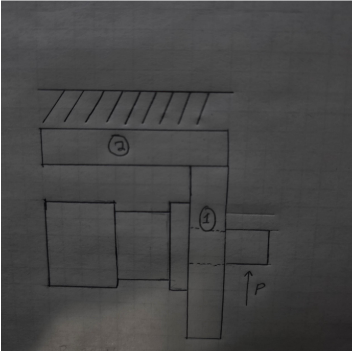
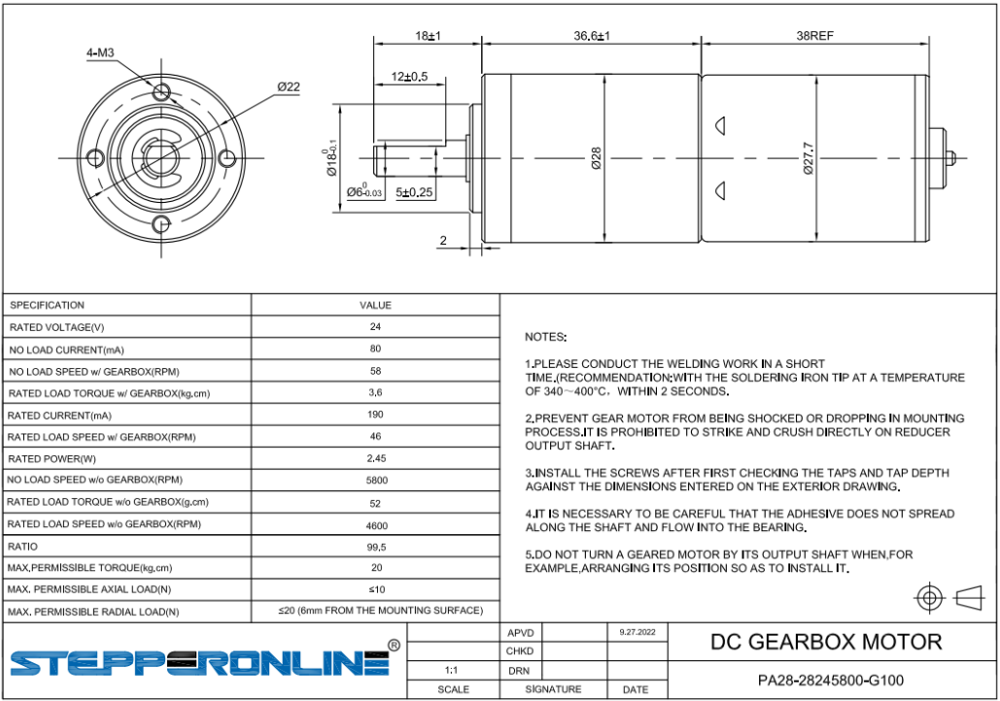
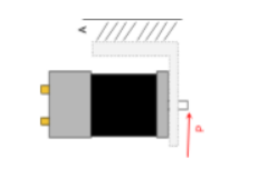
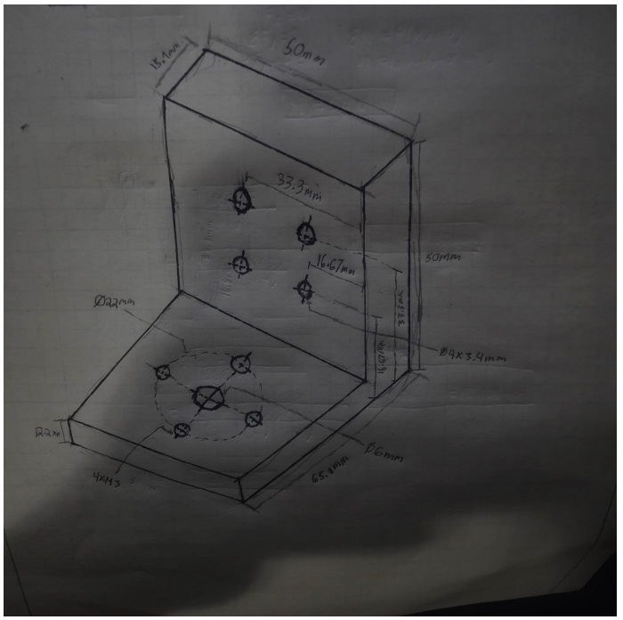
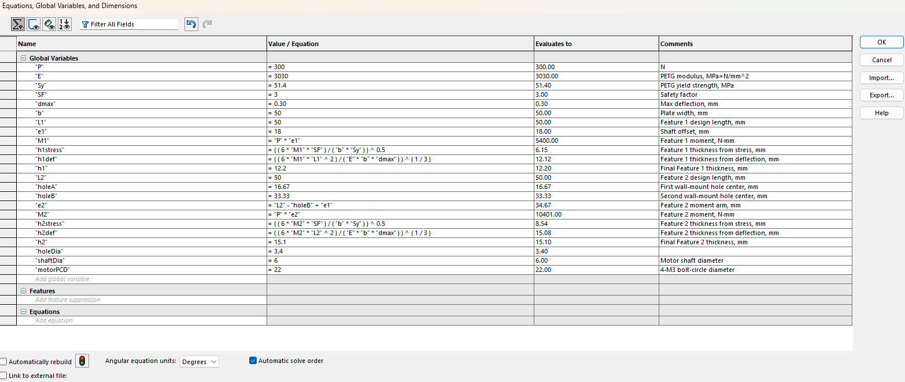
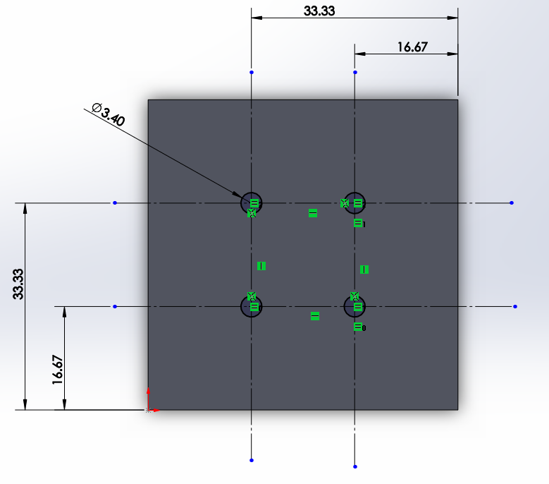
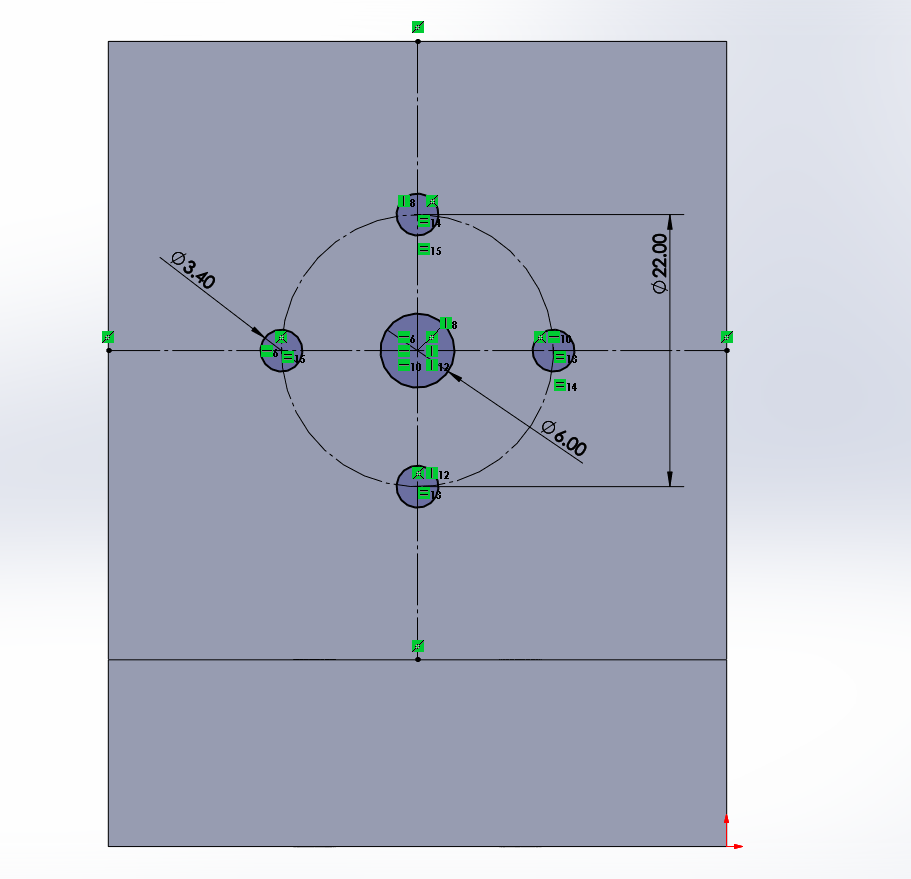
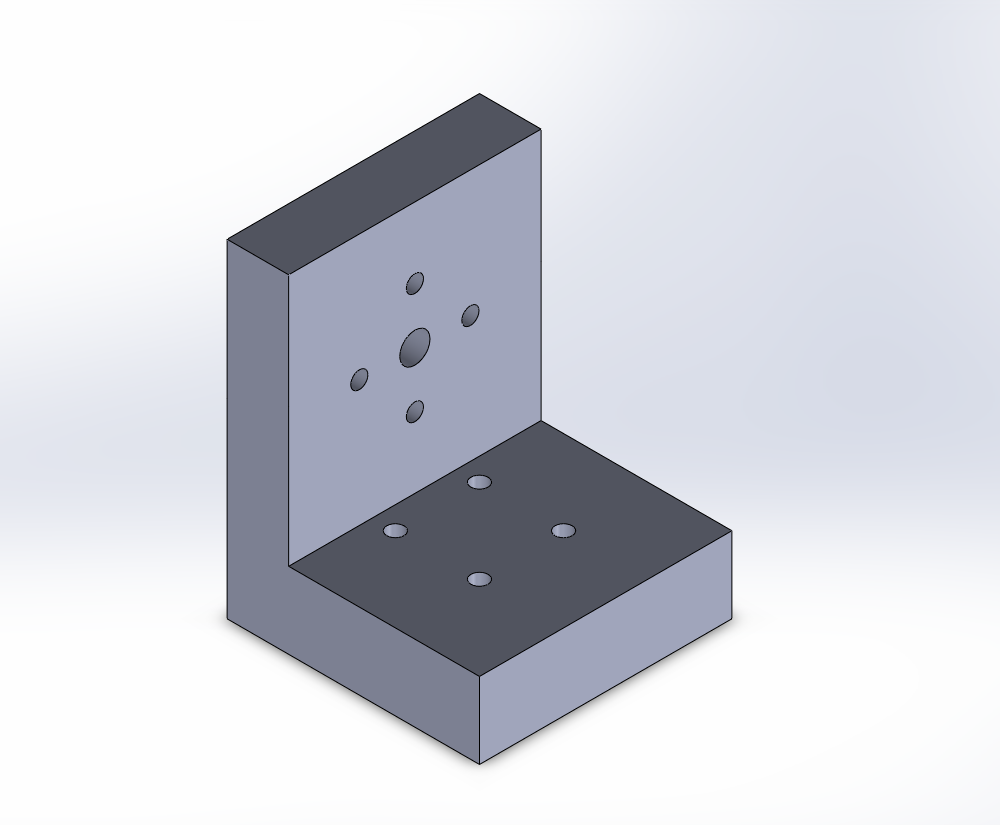
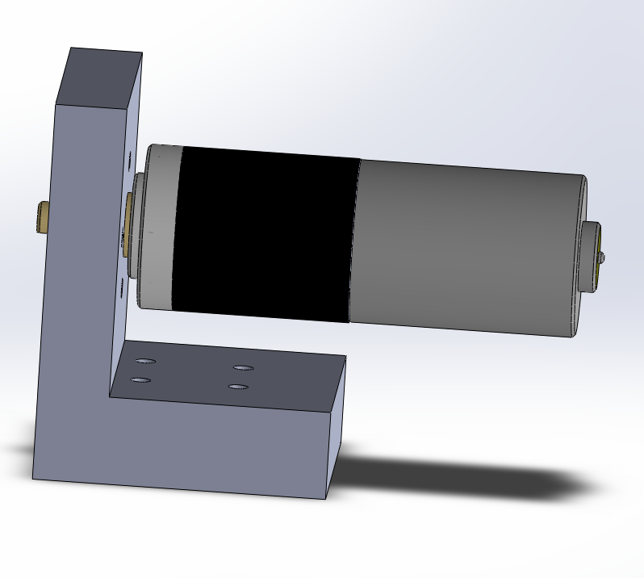

# A4 – Motor Mount

## Objective

The objective of A4 was to design a motor mount for a **Brushed 24 V DC Gear Motor** subjected to an upward load of **300 N** at the end of the motor shaft.

The mount had to:

- Use **ABS, PETG, or PLA**.
- Maintain a minimum **safety factor of 3**.
- Limit maximum deflection to **0.30 mm**.
- Be analyzed as two separate structural features.
- Use the calculated dimensions in a **parametric SolidWorks model**.

For this design:

- **Feature 1** is the vertical motor-mounting plate.
- **Feature 2** is the horizontal plate attached to the rigid wall.

---

## Analyze

### Design Requirements

| Requirement | Value |
|---|---:|
| Applied Load, \(P\) | 300 N |
| Maximum Deflection, \(\delta_{\max}\) | 0.30 mm |
| Required Safety Factor | 3 |
| Plate Width, \(b\) | 50 mm |
| Feature 1 Design Length, \(L_1\) | 50 mm |
| Feature 2 Design Length, \(L_2\) | 50 mm |
| Motor Shaft Offset, \(e_1\) | 18 mm |

### Overall Design Concept

The motor mount consists of two main structural features. **Feature 1** is the vertical motor-mounting plate, while **Feature 2** is the horizontal plate attached to the rigid wall. The applied load acts upward at the end of the motor shaft.

> **Figure #1 — Overall motor-mount concept showing Feature 1, Feature 2, rigid-wall support, and applied load**

### Material Selection

The three provided material options were reviewed:

- **ABS**
- **PETG**
- **PLA**

PETG was selected for the final design.

From the provided PETG material data:

$$E=3.03\text{ GPa}=3030\text{ MPa}$$

$$S_y=51.4\text{ MPa}$$

The allowable stress using the required safety factor is:

$$\sigma_{\text{allow}}=\frac{S_y}{SF}$$

$$\sigma_{\text{allow}}=\frac{51.4}{3}$$

$$\boxed{\sigma_{\text{allow}}=17.13\text{ MPa}}$$

---

## Feature 1 – Motor Mounting Plate

Feature 1 is the vertical plate that attaches directly to the motor.

> **Figure #2 — Feature 1 free-body diagram and hand calculations**

### Feature 1 Moment

The 300 N load acts at the end of the motor shaft, which extends 18 mm from the mounting face.

$$M_1=Pe_1$$

$$M_1=(300)(18)$$

$$\boxed{M_1=5400\text{ N}\cdot\text{mm}=5.40\text{ N}\cdot\text{m}}$$

### Feature 1 Stress Requirement

For a rectangular cross section:

$$I=\frac{bh^3}{12}$$

$$c=\frac{h}{2}$$

Using the bending stress equation:

$$\sigma=\frac{Mc}{I}$$

the required thickness becomes:

$$h_{1,\text{stress}}=\sqrt{\frac{6M_1SF}{bS_y}}$$

$$h_{1,\text{stress}}=\sqrt{\frac{6(5400)(3)}{(50)(51.4)}}$$

$$\boxed{h_{1,\text{stress}}=6.15\text{ mm}}$$

### Feature 1 Deflection Requirement

For the cantilever model:

$$\delta=\frac{ML^2}{2EI}$$

Substituting the rectangular moment of inertia and solving for thickness:

$$h_{1,\text{def}}=\sqrt[3]{\frac{6M_1L_1^2}{Eb\delta_{\max}}}$$

$$h_{1,\text{def}}=\sqrt[3]{\frac{6(5400)(50)^2}{(3030)(50)(0.30)}}$$

$$\boxed{h_{1,\text{def}}=12.12\text{ mm}}$$

The deflection requirement controls the Feature 1 thickness.

The final selected thickness was rounded upward to:

$$\boxed{h_1=12.2\text{ mm}}$$

---

## Feature 2 – Wall Mounting Plate

Feature 2 is the horizontal plate attached to the rigid wall.

The 50 mm plate was divided into thirds for the wall-mounting hole layout.

The second mounting-hole centerline is located at:

$$33.33\text{ mm}$$

from the outside edge.

> **Figure #3 — Feature 2 free-body diagram and moment calculation**

### Feature 2 Moment

The effective moment arm is:

$$e_2=50-33.33+18$$

$$\boxed{e_2=34.67\text{ mm}}$$

Therefore:

$$M_2=Pe_2$$

$$M_2=(300)(34.67)$$

$$\boxed{M_2=10401\text{ N}\cdot\text{mm}=10.40\text{ N}\cdot\text{m}}$$

### Feature 2 Stress Requirement

$$h_{2,\text{stress}}=\sqrt{\frac{6M_2SF}{bS_y}}$$

$$h_{2,\text{stress}}=\sqrt{\frac{6(10401)(3)}{(50)(51.4)}}$$

$$\boxed{h_{2,\text{stress}}=8.54\text{ mm}}$$

### Feature 2 Deflection Requirement

$$h_{2,\text{def}}=\sqrt[3]{\frac{6M_2L_2^2}{Eb\delta_{\max}}}$$

$$h_{2,\text{def}}=\sqrt[3]{\frac{6(10401)(50)^2}{(3030)(50)(0.30)}}$$

$$\boxed{h_{2,\text{def}}=15.08\text{ mm}}$$

The deflection requirement also controls Feature 2.

The final selected thickness was:

$$\boxed{h_2=15.1\text{ mm}}$$

---

## Decide

### Final Design Dimensions

| Parameter | Final Value |
|---|---:|
| Material | PETG |
| Plate Width | 50 mm |
| Feature 1 Height | 50 mm |
| Feature 1 Thickness | 12.2 mm |
| Feature 2 Length | 50 mm |
| Feature 2 Thickness | 15.1 mm |
| M3 Clearance Hole Diameter | 3.4 mm |
| Motor Bolt Circle Diameter | 22 mm |
| Motor Shaft Diameter | 6 mm |
| Wall Hole Centerline 1 | 16.67 mm |
| Wall Hole Centerline 2 | 33.33 mm |

### Isometric Design Sketch

A hand-drawn isometric sketch was created before modeling the part in SolidWorks. The sketch shows the main dimensions, motor-mounting holes, and wall-mounting holes.

> **Figure #4 — Hand-drawn isometric motor-mount design**

### Parametric SolidWorks Model

Global variables and equations were entered into SolidWorks so that the calculated dimensions controlled the model.

The parametric variables included:

- Applied load
- PETG modulus of elasticity
- PETG yield strength
- Safety factor
- Maximum deflection
- Feature lengths
- Feature thickness calculations
- Hole positions
- Hole diameters
- Motor shaft and bolt-circle dimensions

> **Figure #5 — SolidWorks global variables and parametric equations**

### Feature 2 Wall-Mounting Holes

The wall-mounting holes were positioned using the 16.67 mm and 33.33 mm parametric locations.

Four **3.4 mm diameter** clearance holes were used.

> **Figure #6 — Feature 2 parametric wall-mounting hole layout**

### Feature 1 Motor-Mounting Holes

Feature 1 uses four **3.4 mm M3 clearance holes** positioned on a **22 mm bolt circle**, along with the motor shaft opening.

> **Figure #7 — Feature 1 motor-mounting hole pattern**

### Final CAD Model

The final part is a single L-shaped motor mount consisting of Feature 1 and Feature 2.

> **Figure #8 — Final parametric motor-mount CAD model**

### Assembly Check

The completed motor mount was assembled with a CAD model of the motor to verify that the motor and mounting pattern fit the bracket.

> **Figure #9 — Final motor and motor-mount assembly**

---

## Communicate

### Design Summary

Both features were analyzed using bending stress and deflection equations.

For Feature 1:

$$h_{1,\text{stress}}=6.15\text{ mm}$$

$$h_{1,\text{def}}=12.12\text{ mm}$$

Therefore:

$$\boxed{h_1=12.2\text{ mm}}$$

For Feature 2:

$$h_{2,\text{stress}}=8.54\text{ mm}$$

$$h_{2,\text{def}}=15.08\text{ mm}$$

Therefore:

$$\boxed{h_2=15.1\text{ mm}}$$

For both features, **deflection controlled the final design thickness** rather than yielding.

### Design Reflection

The most important result from the analysis was that the motor mount was controlled more by stiffness than by material strength. The stress calculations required much smaller thicknesses, while the 0.30 mm deflection limit required substantially thicker sections.

Using parametric equations in SolidWorks made it easier to connect the hand calculations to the CAD model. The final assembly was also useful because it confirmed that the motor fit the mounting pattern and that the overall bracket geometry was reasonable.

### Mistakes and Improvements

One challenge during the assignment was keeping the orientation and purpose of Feature 1 and Feature 2 consistent between the FBDs, calculations, and CAD model.

Another challenge was setting up the parametric equations in SolidWorks. Some calculated global variables generated warning symbols because the values were entered as unitless numerical variables, even though the equations still evaluated to the expected results.

If the design were revised, the next improvement would be to optimize the overall amount of material while maintaining the same deflection requirement.

### Lessons Learned

This assignment helped reinforce how bending stress and beam deflection can lead to different required dimensions. It also showed how engineering calculations can be connected directly to CAD through parametric variables.

Creating the final motor assembly also showed the importance of checking fit and hole locations instead of relying only on calculations.

### Time Spent

The total time spent completing A4 was approximately:

$$\boxed{12\text{ hours}}$$

---

## CAD Downloads

The completed SolidWorks files are available below:

[Download A4 Motor Mount Part](../../assets/files/A4_Motor_Mount_Florencondia.SLDPRT)

[Download A4 Motor Mount Assembly](../../assets/files/A4_Motor_Mount_Assembly_Florencondia.SLDASM)

[Download A4 Motor Model](../../assets/files/a4_motor.SLDPRT)

---

## References

1. **ABS — SpecialChem:**  
   [Acrylonitrile Butadiene Styrene (ABS): Uses, Properties & Structure](https://www.specialchem.com/plastics/guide/acrylonitrile-butadiene-styrene-abs-plastic)

2. **PETG — MatWeb:**  
   [Overview of materials for PETG Copolyester](https://www.matweb.com/search/DataSheet.aspx?MatGUID=4de1c85bb946406a86c52b688e3810d0&ckck=1)

3. **PLA — MatWeb:**  
   [Overview of materials for Polylactic Acid (PLA) Biopolymer](https://www.matweb.com/search/DataSheet.aspx?MatGUID=ab96a4c0655c4018a8785ac4031b9278&ckck=1)

4. **Machinery's Handbook** — Beam calculations and bending equations.

5. MEGR 2156 A4 Motor Mount assignment instructions.
