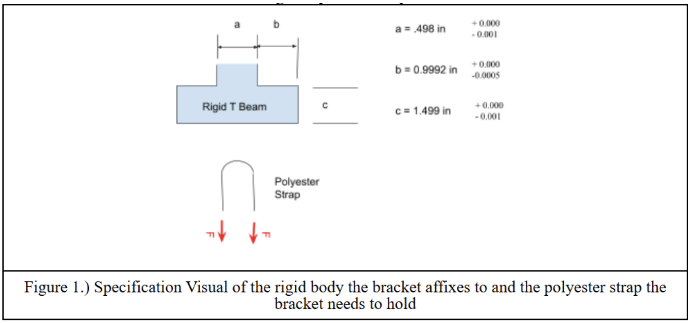
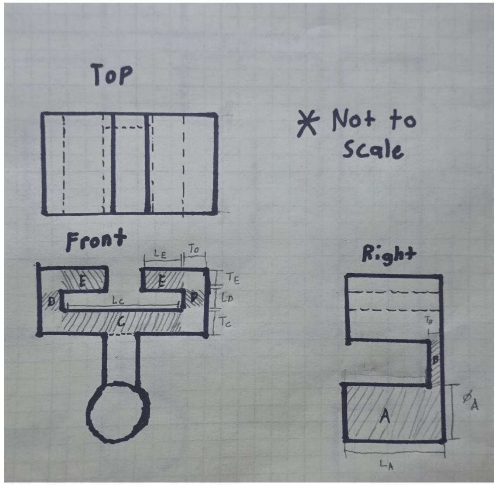
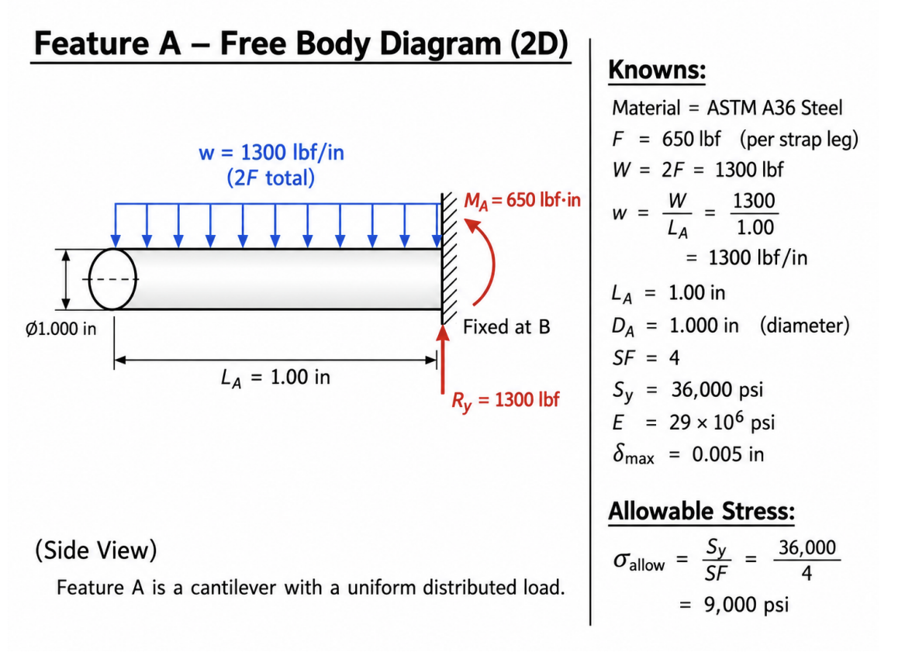
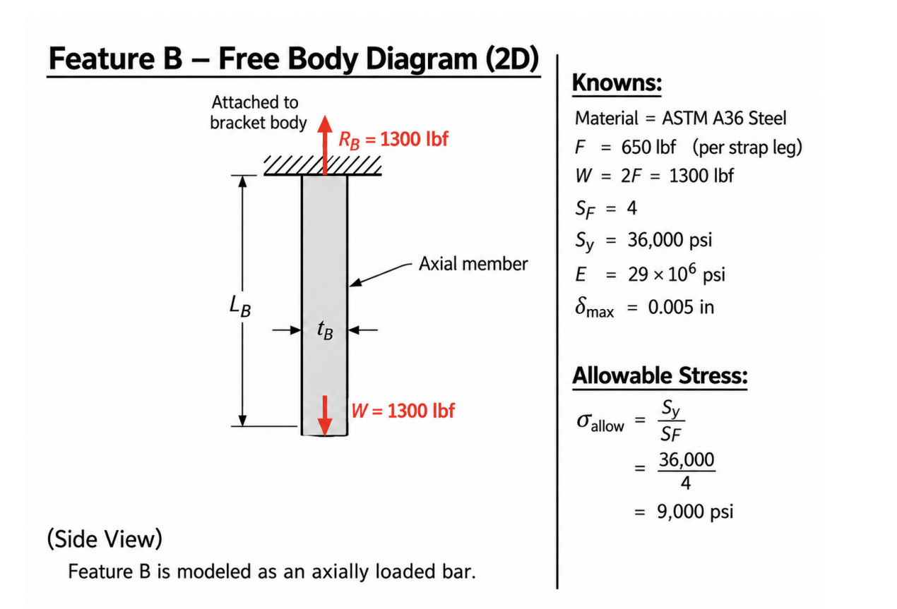
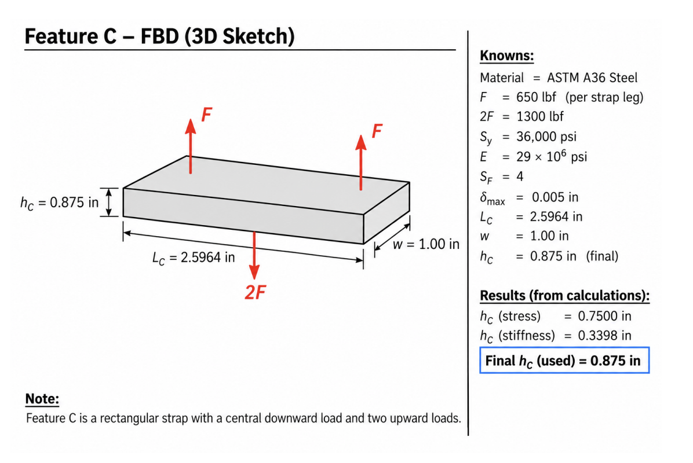
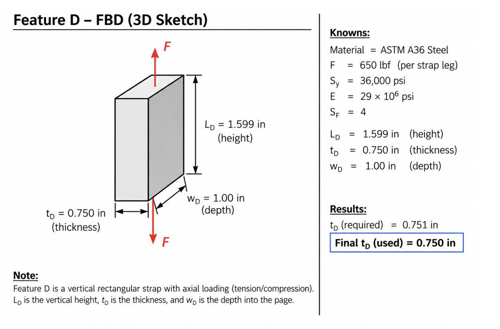
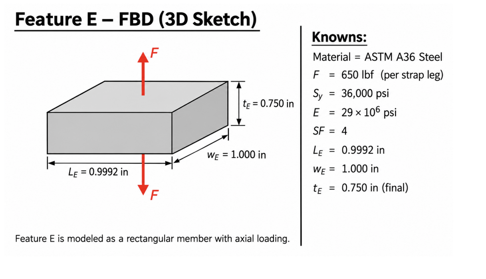
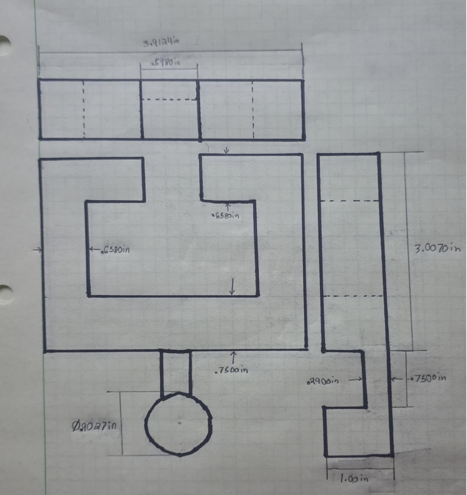
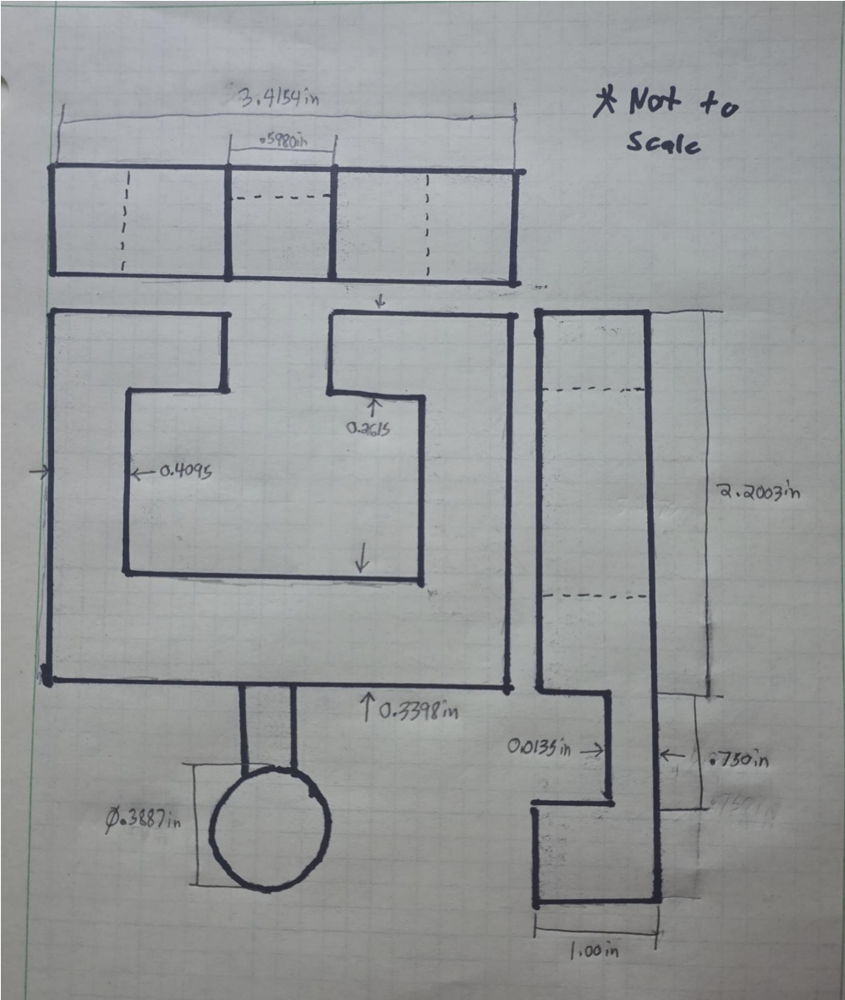
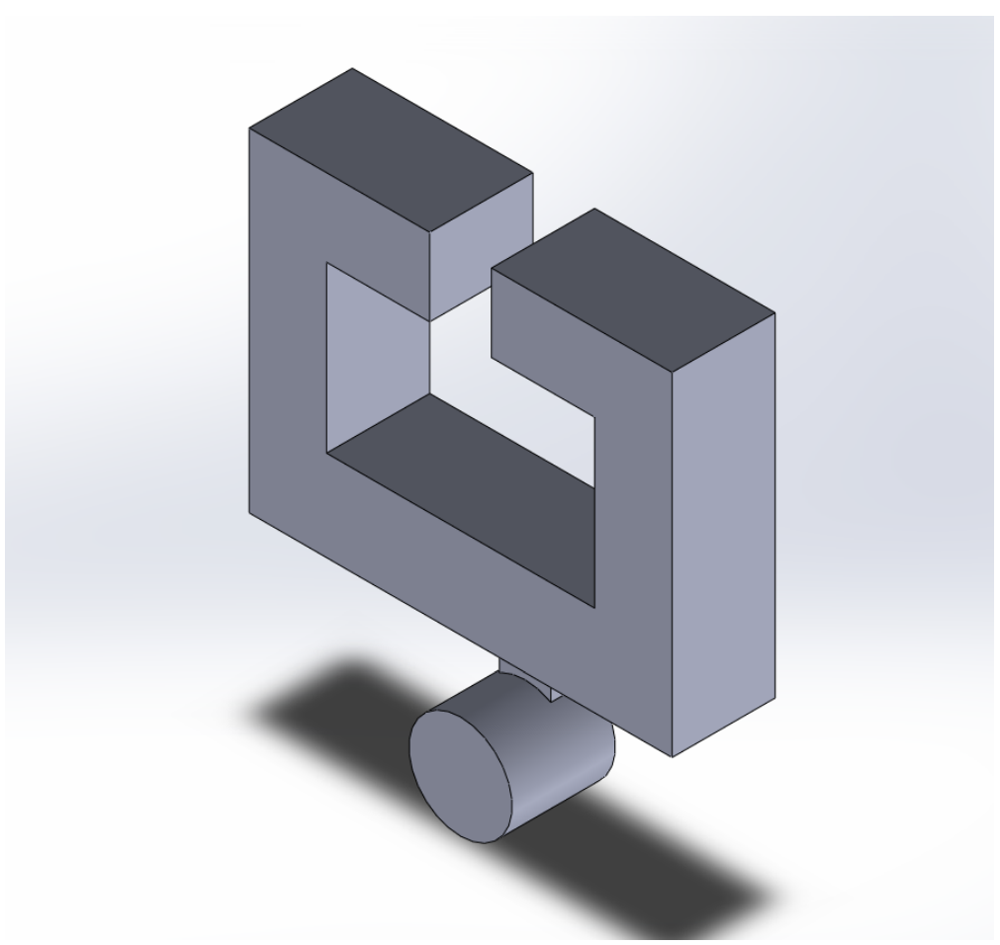

# A5 - Bracket Design

## Objective

The objective of A5 was to design a **symmetric steel bracket** that can slide onto the specified rigid T-beam and support a **3/4 in heavy-duty polyester strap**. The bracket was required to use a **safety factor of 4**, carry a selected strap force between **500 and 800 lbf**, and keep the deflection of each analyzed feature below **0.005 in**.

For this design, I selected:

- **Material:** ASTM A36 Steel
- **Load per strap leg:** \(F=650\text{ lbf}\)
- **Total load transferred into the center of the bracket:** \(2F=1300\text{ lbf}\)
- **Yield strength:** \(S_y=36,000\text{ psi}\)
- **Modulus of elasticity:** \(E=29\times10^6\text{ psi}\)
- **Safety factor:** \(SF=4\)
- **Maximum feature deflection:** \(\delta_{\max}=0.005\text{ in}\)

The allowable normal stress is:

$$
\sigma_{\text{allow}}=\frac{S_y}{SF}
$$

$$
\sigma_{\text{allow}}=\frac{36,000}{4}
$$

$$
\boxed{\sigma_{\text{allow}}=9,000\text{ psi}}
$$

> **Figure A5-1 - Assignment geometry, T-beam dimensions, and polyester strap loading**

---

## Analyze

### T-Beam Geometry and Required Clearance

The rigid T-beam dimensions provided for the assignment were:

| Dimension | Nominal Size | Tolerance |
|---|---:|---:|
| \(a\) | 0.498 in | \(+0.000/-0.001\) in |
| \(b\) | 0.9992 in | \(+0.0000/-0.0005\) in |
| \(c\) | 1.499 in | \(+0.000/-0.001\) in |

Because each tolerance only allows the T-beam to become smaller than the nominal value, the **nominal dimensions are the largest fit condition**. I therefore used the nominal dimensions and added approximately **0.050 in of clearance per side** where the bracket slides around the rail.

The horizontal opening is:

$$
L_C=a+2b+0.100
$$

$$
L_C=0.498+2(0.9992)+0.100
$$

$$
\boxed{L_C=2.5964\text{ in}}
$$

The vertical opening is:

$$
L_D=c+0.100
$$

$$
L_D=1.499+0.100
$$

$$
\boxed{L_D=1.599\text{ in}}
$$

Each upper arm extends inward by the flange dimension:

$$
\boxed{L_E=b=0.9992\text{ in}}
$$

The center opening between the two upper arms is:

$$
2.5964-2(0.9992)=\boxed{0.5980\text{ in}}
$$

This provides approximately 0.050 in of clearance on each side of the \(0.498\) in T-beam stem.

### Rough Design Concept

I used a symmetric bracket because it keeps the T-beam centered and makes the load path easier to analyze. The design was divided into five features:

- **Feature A:** cylindrical strap support
- **Feature B:** vertical connector between A and C
- **Feature C:** lower horizontal member
- **Feature D:** vertical side member
- **Feature E:** upper horizontal arm

The rough multiview sketch was used to establish the variables before the stress and stiffness calculations were completed.

> **Figure A5-2 - Rough multiview concept and feature-variable layout**

---

## Feature A - Cylindrical Strap Support

Feature A is modeled as a **circular cantilever beam** fixed at Feature B. The drawing convention defines \(L_A=1.000\) in as the **overall** length of Feature A, including the portion overlapped by Feature B. For the analytical model, the full \(1.000\) in length is conservatively used as the cantilever span with the total strap load uniformly distributed across it. Because the actual exposed span is shorter once the Feature B overlap is considered, this assumption does not underpredict the bending demand.

### Knowns and Unknown

$$
W=2F=1300\text{ lbf}
$$

$$
L_A=1.000\text{ in}
$$

$$
E=29\times10^6\text{ psi}
$$

$$
\sigma_{\text{allow}}=9000\text{ psi}
$$

$$
\delta_{\max}=0.005\text{ in}
$$

Unknown:

$$
\boxed{D_A=?}
$$

### Assumptions

Feature A is assumed to have a constant circular cross section, Feature B acts as the fixed support, the strap load is uniformly distributed across the analytical length, self-weight is neglected, and direct shear failure is neglected as permitted by the assignment.

> **Figure A5-3 - Feature A free-body diagram**

### Stress Analysis

For a cantilever carrying a total uniformly distributed load \(W\):

$$
M_{\max}=\frac{WL_A}{2}
$$

$$
M_{\max}=\frac{(1300)(1.000)}{2}
$$

$$
\boxed{M_{\max}=650\text{ lbf}\cdot\text{in}}
$$

For a circular section:

$$
S=\frac{\pi D_A^3}{32}
$$

Using:

$$
\sigma=\frac{M}{S}
$$

and setting \(\sigma=\sigma_{\text{allow}}\):

$$
9000=\frac{32(650)}{\pi D_A^3}
$$

Solving for diameter:

$$
D_{A,\text{stress}}
=
\sqrt[3]{\frac{32(650)}{\pi(9000)}}
$$

$$
\boxed{D_{A,\text{stress}}=0.9027\text{ in}}
$$

### Stiffness Analysis

For a cantilever with a uniformly distributed total load:

$$
\delta=\frac{WL_A^3}{8EI}
$$

For a circular section:

$$
I=\frac{\pi D_A^4}{64}
$$

Substituting and solving for \(D_A\):

$$
D_{A,\text{stiff}}
=
\sqrt[4]{\frac{8WL_A^3}{\pi E\delta_{\max}}}
$$

$$
D_{A,\text{stiff}}
=
\sqrt[4]{\frac{8(1300)(1.000)^3}{\pi(29\times10^6)(0.005)}}
$$

$$
\boxed{D_{A,\text{stiff}}=0.3887\text{ in}}
$$

Stress controls Feature A because:

$$
0.9027>0.3887
$$

The final selected diameter was rounded upward to:

$$
\boxed{D_A=1.000\text{ in}}
$$

---

## Feature B - Vertical Connector

Feature B transfers the full \(1300\) lbf load from Feature A into Feature C and is modeled as an **axially loaded rectangular member**.

### Knowns and Unknown

$$
P_B=1300\text{ lbf}
$$

$$
L_B=0.750\text{ in}
$$

$$
w_B=0.498\text{ in}
$$

$$
E=29\times10^6\text{ psi}
$$

$$
\sigma_{\text{allow}}=9000\text{ psi}
$$

$$
\delta_{\max}=0.005\text{ in}
$$

Unknown:

$$
\boxed{T_B=?}
$$

The \(0.498\) in width matches dimension \(a\) so Feature B stays centered under the T-beam stem. The \(0.750\) in vertical length is measured from the **top of Feature A to the bottom of Feature C** and was selected to provide clearance between the cylindrical strap support and the lower bracket member.

### Assumptions

The load is centered through the rectangular cross section, bending is neglected, the cross section is uniform, and direct shear failure is neglected.

> **Figure A5-4 - Feature B free-body diagram**

### Stress Analysis

The cross-sectional area is:

$$
A_B=w_BT_B
$$

Axial stress is:

$$
\sigma=\frac{P_B}{A_B}
$$

Solving for thickness:

$$
T_{B,\text{stress}}
=
\frac{P_B}{w_B\sigma_{\text{allow}}}
$$

$$
T_{B,\text{stress}}
=
\frac{1300}{(0.498)(9000)}
$$

$$
\boxed{T_{B,\text{stress}}=0.2900\text{ in}}
$$

### Stiffness Analysis

Axial deformation is:

$$
\delta=\frac{PL}{AE}
$$

Solving for \(T_B\):

$$
T_{B,\text{stiff}}
=
\frac{P_BL_B}{Ew_B\delta_{\max}}
$$

$$
T_{B,\text{stiff}}
=
\frac{(1300)(0.750)}
{(29\times10^6)(0.498)(0.005)}
$$

$$
\boxed{T_{B,\text{stiff}}=0.01350\text{ in}}
$$

Stress controls Feature B.

The final selected thickness was:

$$
\boxed{T_B=0.375\text{ in}}
$$

For the drawing convention used in this project, \(L_A=1.000\) in is the **overall** Feature A length and Feature B overlaps a portion of that length. Therefore, the exposed portion of Feature A is \(L_{A,\mathrm{exposed}}=L_A-T_B\).

---

## Feature C - Lower Horizontal Member

Feature C carries the full \(2F=1300\) lbf load at its center. Because the bracket is symmetric, the two side members each provide a reaction of \(F=650\) lbf.

### Knowns and Unknown

$$
P_C=1300\text{ lbf}
$$

$$
L_C=2.5964\text{ in}
$$

$$
w_C=1.000\text{ in}
$$

$$
E=29\times10^6\text{ psi}
$$

$$
\sigma_{\text{allow}}=9000\text{ psi}
$$

$$
\delta_{\max}=0.005\text{ in}
$$

Unknown:

$$
\boxed{T_C=?}
$$

### Assumptions

Feature C is treated as a simply supported rectangular beam with a center point load. The two reactions are equal because of symmetry. Shear deformation and self-weight are neglected.

> **Figure A5-5 - Feature C free-body diagram**

### Stress Analysis

For a simply supported beam with a center point load:

$$
M_{\max}=\frac{P_CL_C}{4}
$$

$$
M_{\max}=\frac{(1300)(2.5964)}{4}
$$

$$
\boxed{M_{\max}=843.83\text{ lbf}\cdot\text{in}}
$$

For a rectangular section:

$$
S=\frac{w_CT_C^2}{6}
$$

Therefore:

$$
T_{C,\text{stress}}
=
\sqrt{\frac{6M_{\max}}
{w_C\sigma_{\text{allow}}}}
$$

$$
T_{C,\text{stress}}
=
\sqrt{\frac{6(843.83)}
{(1.000)(9000)}}
$$

$$
\boxed{T_{C,\text{stress}}=0.7500\text{ in}}
$$

### Stiffness Analysis

For a simply supported beam with a center point load:

$$
\delta=\frac{P_CL_C^3}{48EI}
$$

with:

$$
I=\frac{w_CT_C^3}{12}
$$

Solving for thickness:

$$
T_{C,\text{stiff}}
=
\sqrt[3]{\frac{P_CL_C^3}
{4Ew_C\delta_{\max}}}
$$

$$
T_{C,\text{stiff}}
=
\sqrt[3]{\frac{(1300)(2.5964)^3}
{4(29\times10^6)(1.000)(0.005)}}
$$

$$
\boxed{T_{C,\text{stiff}}=0.3398\text{ in}}
$$

Stress controls Feature C.

The final selected thickness was:

$$
\boxed{T_C=0.875\text{ in}}
$$

---

## Feature D - Vertical Side Member

Feature D transfers the load between the lower member and the upper arm. An important correction was made during the double-checking stage: the early sketch treated D as primarily axial, but Feature E creates an **eccentric prying moment** at D. The final sizing therefore treats D as a vertical cantilever subjected to the end moment created by Feature E.

> **Figure A5-6 - Preliminary Feature D load-path sketch**

### Knowns and Unknown

$$
F=650\text{ lbf}
$$

$$
L_D=1.599\text{ in}
$$

$$
L_E=0.9992\text{ in}
$$

$$
w_D=1.000\text{ in}
$$

$$
E=29\times10^6\text{ psi}
$$

$$
\sigma_{\text{allow}}=9000\text{ psi}
$$

$$
\delta_{\max}=0.005\text{ in}
$$

Unknown:

$$
\boxed{T_D=?}
$$

### End Moment from Feature E

The force on E produces:

$$
M_D=FL_E
$$

$$
M_D=(650)(0.9992)
$$

$$
\boxed{M_D=649.48\text{ lbf}\cdot\text{in}}
$$

### Stress Analysis

For the rectangular D cross section:

$$
S_D=\frac{w_DT_D^2}{6}
$$

Therefore:

$$
T_{D,\text{stress}}
=
\sqrt{\frac{6M_D}
{w_D\sigma_{\text{allow}}}}
$$

$$
T_{D,\text{stress}}
=
\sqrt{\frac{6(649.48)}
{(1.000)(9000)}}
$$

$$
\boxed{T_{D,\text{stress}}=0.6580\text{ in}}
$$

### Stiffness Analysis

For a cantilever of length \(L_D\) with an applied end moment:

$$
\delta=\frac{M_DL_D^2}{2EI}
$$

and:

$$
I=\frac{w_DT_D^3}{12}
$$

Solving for thickness:

$$
T_{D,\text{stiff}}
=
\sqrt[3]{\frac{6M_DL_D^2}
{Ew_D\delta_{\max}}}
$$

$$
T_{D,\text{stiff}}
=
\sqrt[3]{\frac{6(649.48)(1.599)^2}
{(29\times10^6)(1.000)(0.005)}}
$$

$$
\boxed{T_{D,\text{stiff}}=0.4096\text{ in}}
$$

Stress controls Feature D.

The final selected thickness was:

$$
\boxed{T_D=0.750\text{ in}}
$$

As an additional conservative check, if the \(650\) lbf axial force shown in the preliminary sketch is superimposed on the bending stress for the final \(0.750\) in section:

$$
\sigma_{\text{combined}}
\approx
\frac{6M_D}{w_DT_D^2}
+
\frac{F}{w_DT_D}
$$

$$
\sigma_{\text{combined}}
\approx
6928+867
$$

$$
\boxed{\sigma_{\text{combined}}\approx7795\text{ psi}<9000\text{ psi}}
$$

The final selected D thickness therefore remains below the allowable normal stress even under this more conservative check.

---

## Feature E - Upper Horizontal Arm

Feature E closes over the T-beam flange. The early sketch was used to establish its geometry and load path, while the final analytical model treats E as a **horizontal cantilever** with a downward end load \(F\).

> **Figure A5-7 - Preliminary Feature E load-path sketch**

### Knowns and Unknown

$$
F=650\text{ lbf}
$$

$$
L_E=0.9992\text{ in}
$$

$$
w_E=1.000\text{ in}
$$

$$
E=29\times10^6\text{ psi}
$$

$$
\sigma_{\text{allow}}=9000\text{ psi}
$$

$$
\delta_{\max}=0.005\text{ in}
$$

Unknown:

$$
\boxed{T_E=?}
$$

### Stress Analysis

The maximum moment at the fixed end is:

$$
M_E=FL_E
$$

$$
M_E=(650)(0.9992)
$$

$$
\boxed{M_E=649.48\text{ lbf}\cdot\text{in}}
$$

For a rectangular section:

$$
T_{E,\text{stress}}
=
\sqrt{\frac{6M_E}
{w_E\sigma_{\text{allow}}}}
$$

$$
\boxed{T_{E,\text{stress}}=0.6580\text{ in}}
$$

### Stiffness Analysis

For a cantilever with a point load at the free end:

$$
\delta=\frac{FL_E^3}{3EI}
$$

with:

$$
I=\frac{w_ET_E^3}{12}
$$

Solving for \(T_E\):

$$
T_{E,\text{stiff}}
=
\sqrt[3]{\frac{4FL_E^3}
{Ew_E\delta_{\max}}}
$$

$$
T_{E,\text{stiff}}
=
\sqrt[3]{\frac{4(650)(0.9992)^3}
{(29\times10^6)(1.000)(0.005)}}
$$

$$
\boxed{T_{E,\text{stiff}}=0.2615\text{ in}}
$$

Stress controls Feature E.

The final selected thickness was:

$$
\boxed{T_E=0.750\text{ in}}
$$

---

## Stress and Stiffness Comparison

The calculated minimum dimensions are summarized below.

| Feature | Stress Minimum | Stiffness Minimum | Governing Requirement | Final Selected |
|---|---:|---:|---|---:|
| A - diameter | 0.9027 in | 0.3887 in | Stress | 1.000 in |
| B - thickness | 0.2900 in | 0.01350 in | Stress | 0.375 in |
| C - height | 0.7500 in | 0.3398 in | Stress | 0.875 in |
| D - thickness | 0.6580 in | 0.4096 in | Stress | 0.750 in |
| E - thickness | 0.6580 in | 0.2615 in | Stress | 0.750 in |

For all five features, the **stress requirement governs** over the stiffness requirement.

---

## Stress-Based Multiview

The stress multiview uses the calculated minimum dimensions from the stress analysis while retaining the fixed T-beam fit dimensions. The drawing is explicitly marked **NOT TO SCALE (NTS)**. The dimension callouts define the geometry; distances measured directly from the paper are not intended to equal the calculated dimensions.

Important stress dimensions are:

$$
D_A=0.9027\text{ in}
$$

$$
T_B=0.2900\text{ in}
$$

$$
T_C=0.7500\text{ in}
$$

$$
T_D=0.6580\text{ in}
$$

$$
T_E=0.6580\text{ in}
$$

The stress-based overall D-to-D width is:

$$
2.5964+2(0.6580)=\boxed{3.9124\text{ in}}
$$

The stress-based bottom-of-C to top-of-E height is approximately:

$$
0.7500+1.599+0.6580
=
\boxed{3.0070\text{ in}}
$$

> **Figure A5-8 - Stress-based multiview drawing**

---

## Stiffness-Based Multiview

The stiffness multiview uses the **same front, top, and right-view layout and the same sketch proportions** as the stress multiview. Only the dimensions controlled by stiffness are replaced by the calculated stiffness minimums. This drawing is explicitly **NOT TO SCALE (NTS)**, so the apparent size of a feature on paper does not need to shrink in proportion to its numerical stiffness value. The written dimension callouts are authoritative.

The stiffness dimensions are:

$$
D_A=0.3887\text{ in}
$$

$$
T_B=0.01350\text{ in}
$$

$$
T_C=0.3398\text{ in}
$$

$$
T_D=0.4096\text{ in}
$$

$$
T_E=0.2615\text{ in}
$$

The stiffness-based overall D-to-D width is approximately:

$$
2.5964+2(0.4096)
=
\boxed{3.4156\text{ in}}
$$

The stiffness-based bottom-of-C to top-of-E height is approximately:

$$
0.3398+1.599+0.2615
=
\boxed{2.2003\text{ in}}
$$

> **Figure A5-9 - Stiffness-based multiview drawing**

---

## Decide

### Final CAD Dimensions

The calculated minimum values were rounded upward to practical dimensions for the final CAD model.

| Feature / Parameter | Final Value |
|---|---:|
| Material | ASTM A36 Steel |
| Feature A diameter, \(D_A\) | 1.000 in |
| Feature A overall length, \(L_A\) | 1.000 in |
| Feature B front-view width | 0.498 in |
| Feature B vertical length, \(L_B\) | 0.750 in |
| Feature B thickness, \(T_B\) | 0.375 in |
| Feature C inside span, \(L_C\) | 2.5964 in |
| Feature C depth, \(w_C\) | 1.000 in |
| Feature C height, \(T_C\) | 0.875 in |
| Feature D vertical opening/height, \(L_D\) | 1.599 in |
| Feature D depth, \(w_D\) | 1.000 in |
| Feature D thickness, \(T_D\) | 0.750 in |
| Feature E reach, \(L_E\) | 0.9992 in |
| Feature E depth, \(w_E\) | 1.000 in |
| Feature E thickness, \(T_E\) | 0.750 in |
| Top center opening | 0.5980 in |
| Overall D-to-D width | 4.0964 in |
| Bottom of C to top of E | 3.224 in |

The final overall width is:

$$
2.5964+2(0.750)
=
\boxed{4.0964\text{ in}}
$$

The final C-to-E height is:

$$
0.875+1.599+0.750
=
\boxed{3.224\text{ in}}
$$

### Final Analytical Verification

The rounded CAD dimensions were checked again against the same stress and stiffness equations.

| Feature | Final Stress | Allowable Stress | Final Deflection | Allowed Deflection |
|---|---:|---:|---:|---:|
| A | 6,621 psi | 9,000 psi | 0.000114 in | 0.005 in |
| B | 6,961 psi | 9,000 psi | 0.000180 in | 0.005 in |
| C | 6,613 psi | 9,000 psi | 0.000293 in | 0.005 in |
| D | 6,928 psi bending | 9,000 psi | 0.000814 in | 0.005 in |
| E | 6,928 psi | 9,000 psi | 0.000212 in | 0.005 in |

All five final feature dimensions satisfy both the allowable stress and maximum-deflection requirements.

### Final CAD Model

The final SolidWorks model uses the rounded dimensions rather than the exact analytical minimums. This provides manufacturing margin while keeping the geometry simple and symmetric.

> **Figure A5-10 - Final A5 bracket CAD model**

---

## Communicate

### Design Summary

The final bracket uses **ASTM A36 steel**, a selected strap force of **650 lbf per leg**, and a required safety factor of **4**. The load path was divided into five features and each feature was checked independently for both stress and stiffness.

The calculations showed that **stress governed all five features**. The final CAD dimensions were therefore rounded upward from the stress-controlled minimums:

$$
\boxed{
D_A=1.000,\;
T_B=0.375,\;
T_C=0.875,\;
T_D=0.750,\;
T_E=0.750\text{ in}
}
$$

The final bracket also includes approximately **0.050 in clearance per side** around the critical T-beam dimensions so that the part can slide onto the rail without relying on an interference fit.

### Error Propagation and Double-Checking

A major part of this assignment was making sure one incorrect assumption did not propagate into every later feature. The most important example was the connection between Features D and E. An early sketch treated the side wall as axial, but the load on E is offset from D and therefore creates a prying moment. Rechecking the load path changed the final D analytical model to bending.

The geometry also required repeated checking because the T-beam dimensions determine \(L_C\), \(L_D\), \(L_E\), and the top opening. Changing one of those values changes several other dimensions. Keeping the fixed fit dimensions separate from the stress- and stiffness-controlled dimensions made the final drawings more consistent.

### Lessons Learned

This assignment reinforced that the hardest part of an engineering calculation is often not the algebra itself, but choosing the correct model before using the equation. The free-body diagrams took a large amount of time because each support, reaction, and load path had to agree with the actual bracket geometry.

I also learned the importance of separating three different types of dimensions: dimensions required for **fit**, dimensions calculated from **stress or stiffness**, and dimensions finally selected for **manufacturing/CAD**. The analytical result gives the minimum acceptable value, while the final CAD dimension can be rounded upward to a more practical size.

The repeated checking of the FBDs, T-beam clearances, stress equations, stiffness equations, and multiview dimensions took more time than expected, but it reduced the chance of carrying an early mistake into the final CAD model.

### Time Spent

The total time spent completing A5 was approximately:

$$
\boxed{10\text{ hours}}
$$

Most of this time was spent developing and correcting the free-body diagrams, checking the load path between features, and verifying the dimensions and calculations.

---

## CAD Download

The final SolidWorks part is linked below:

[A5 Bracket SolidWorks Part](../../assets/files/A5_Bracket_Florencondia.SLDPRT)

---

## References

1. MEGR 2156 A5 Bracket Design assignment specifications and T-beam dimensions.
2. Uline Heavy-Duty Polyester Cord Strapping, 3/4 in width.
3. ASTM A36 steel material properties used for \(S_y\) and \(E\).
4. *Machinery's Handbook* - section properties, bending stress, axial deformation, and beam-deflection equations.
