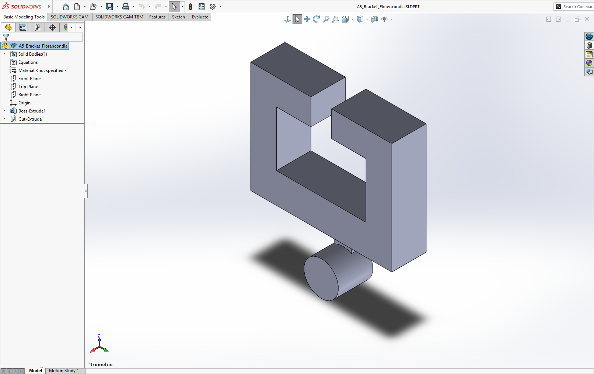
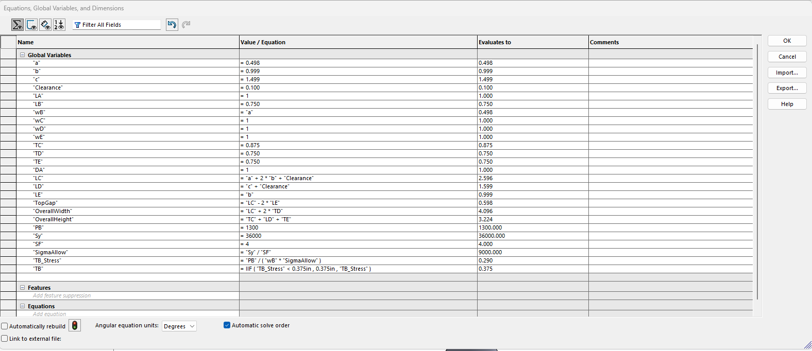
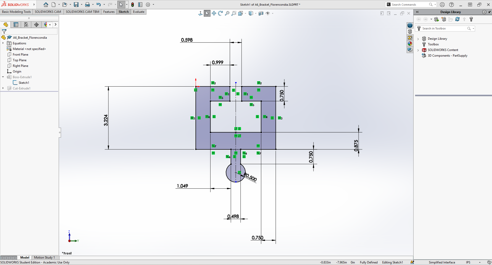
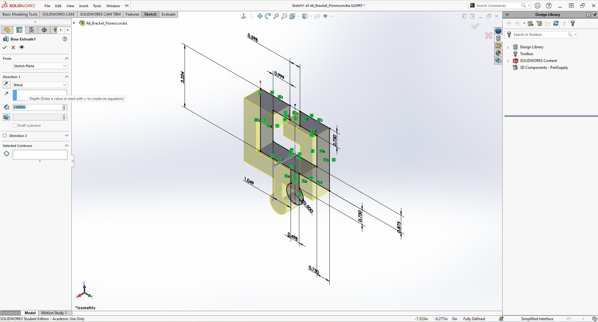
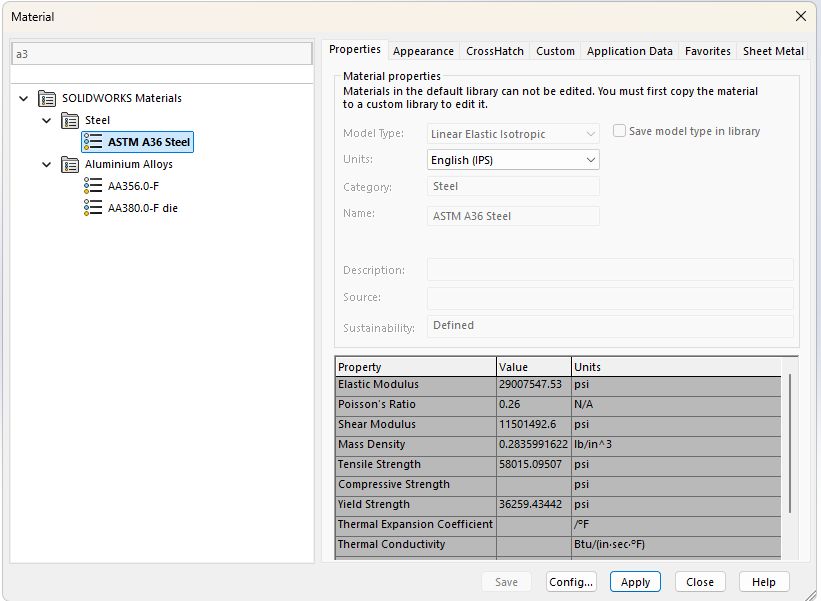
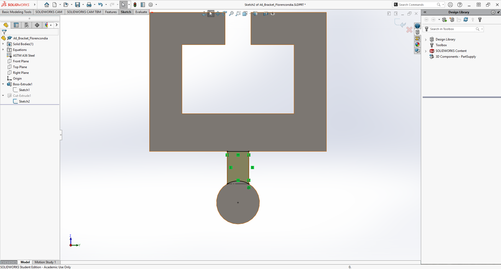
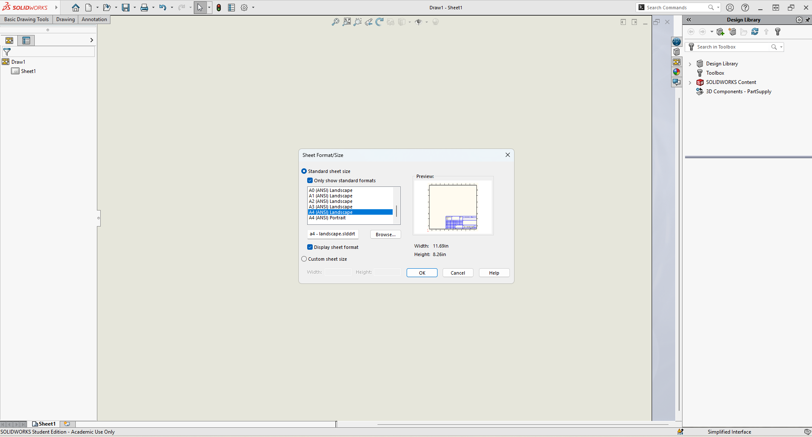
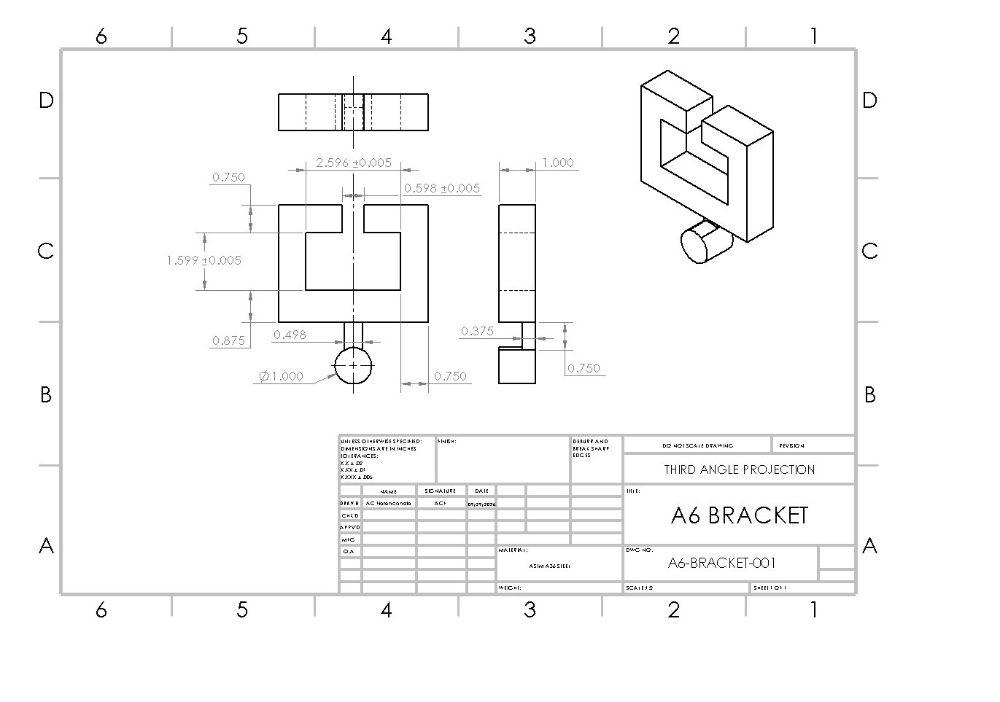

<!--
A6 WORKING PROTOTYPE
This page is intentionally built as a complete A6 structure before the physical CAD/drawing work is finished.
Replace the image files and revise any process/reflection wording so it matches what was actually done before final submission.
Image numbering continues from A5: 56.png and up.
-->

# A6 - Design for Strength and Stiffness II

## Objective

The objective of A6 is to continue the bracket design from A5 by turning the selected geometry into a **parametrically controlled SolidWorks model** and a **fully dimensioned engineering drawing**.

A5 established the bracket geometry by checking the five main features for both strength and stiffness. A6 continues from those results rather than repeating the complete analysis. The main goals are to:

- carry the final A5 dimensions into a parametric CAD model,
- connect important CAD dimensions to named parameters and equations,
- create a fully dimensioned **third-angle multiview drawing**,
- apply appropriate tolerances to the T-beam sliding interfaces,
- include the required general tolerance block,
- and document the design process, decisions, mistakes, and lessons learned.

The A6 model uses the same final bracket concept developed in A5.

> **Figure A6-1 - A5 bracket used as the starting geometry for A6**
>
> 

---

## Analyze

### A5 Design Carried Into A6

The bracket from A5 was divided into five features:

- **Feature A:** cylindrical strap support
- **Feature B:** vertical connector
- **Feature C:** lower horizontal member
- **Feature D:** vertical side member
- **Feature E:** upper horizontal arm

The A5 analysis compared the minimum dimension required by **stress** with the minimum dimension required by **stiffness**. Stress governed all five features, and each final CAD dimension was rounded upward from the governing analytical value.

| Feature | Stress Minimum | Stiffness Minimum | Governing Requirement | Final A5 Dimension |
|---|---:|---:|---|---:|
| A - diameter | 0.9027 in | 0.3887 in | Stress | 1.000 in |
| B - thickness | 0.2900 in | 0.01350 in | Stress | 0.375 in |
| C - height | 0.7500 in | 0.3398 in | Stress | 0.875 in |
| D - thickness | 0.6580 in | 0.4096 in | Stress | 0.750 in |
| E - thickness | 0.6580 in | 0.2615 in | Stress | 0.750 in |

The selected A5 dimensions form the dimensional baseline for the A6 parametric model.

### Final A5 Geometry

| Parameter | Final Value |
|---|---:|
| Material | ASTM A36 Steel |
| Feature A diameter, \(D_A\) | 1.000 in |
| Feature A overall length, \(L_A\) | 1.000 in |
| Feature B front-view width, \(w_B\) | 0.498 in |
| Feature B vertical length, \(L_B\) | 0.750 in |
| Feature B thickness, \(T_B\) | 0.375 in |
| Feature C inside span, \(L_C\) | 2.5964 in |
| Feature C depth, \(w_C\) | 1.000 in |
| Feature C height, \(T_C\) | 0.875 in |
| Feature D vertical opening, \(L_D\) | 1.599 in |
| Feature D depth, \(w_D\) | 1.000 in |
| Feature D thickness, \(T_D\) | 0.750 in |
| Feature E reach, \(L_E\) | 0.9992 in |
| Feature E depth, \(w_E\) | 1.000 in |
| Feature E thickness, \(T_E\) | 0.750 in |
| Top center opening | 0.5980 in |
| Overall D-to-D width | 4.0964 in |
| Bottom of C to top of E | 3.224 in |

These dimensions already satisfy the A5 strength and stiffness requirements, so A6 focuses on controlling them parametrically and communicating them correctly through an engineering drawing.

---

## T-Beam Interface Geometry

The bracket must slide over the rigid T-beam specified in the assignment.

| T-Beam Dimension | Nominal Size | Given Tolerance |
|---|---:|---:|
| \(a\) | 0.498 in | \(+0.000/-0.001\) in |
| \(b\) | 0.9992 in | \(+0.0000/-0.0005\) in |
| \(c\) | 1.499 in | \(+0.000/-0.001\) in |

The T-beam dimensions are important because they control the internal geometry of the bracket.

The horizontal opening used in the bracket is:

$$
L_C=a+2b+0.100
$$

$$
L_C=0.498+2(0.9992)+0.100
$$

$$
\boxed{L_C=2.5964\text{ in}}
$$

The vertical opening is:

$$
L_D=c+0.100
$$

$$
L_D=1.499+0.100
$$

$$
\boxed{L_D=1.599\text{ in}}
$$

The upper-arm reach follows the T-beam flange dimension:

$$
\boxed{L_E=b=0.9992\text{ in}}
$$

The opening between the two upper arms is:

$$
\text{Top Opening}=L_C-2L_E
$$

$$
\text{Top Opening}=2.5964-2(0.9992)
$$

$$
\boxed{\text{Top Opening}=0.5980\text{ in}}
$$

This geometry preserves the sliding clearance established during A5.

> **Figure A6-2 - T-beam interface and bracket dimensions carried forward from A5**
>
> 

---

# Parametric Design

## Parametric Modeling Strategy

The original A5 geometry was created primarily by entering dimensions directly into the SolidWorks sketches and features. For A6, the same geometry is reorganized so that the important dimensions are controlled through **global variables and equations**.

The purpose of this change is not to redesign the bracket. The purpose is to make the existing engineering decisions visible inside the CAD model and make related dimensions update together.

The main variables used for the bracket are:

| Global Variable | Meaning | Value / Expression |
|---|---|---:|
| `a` | T-beam stem width | 0.498 in |
| `b` | T-beam flange dimension | 0.9992 in |
| `c` | T-beam height | 1.499 in |
| `Clearance` | Total added clearance | 0.100 in |
| `DA` | Feature A diameter | 1.000 in |
| `LA` | Feature A overall length | 1.000 in |
| `wB` | Feature B front width | 0.498 in |
| `LB` | Feature B vertical length | 0.750 in |
| `TB` | Feature B thickness | 0.375 in |
| `LC` | Feature C inside span | `a + 2*b + Clearance` |
| `wC` | Feature C depth | 1.000 in |
| `TC` | Feature C height | 0.875 in |
| `LD` | Feature D opening | `c + Clearance` |
| `wD` | Feature D depth | 1.000 in |
| `TD` | Feature D thickness | 0.750 in |
| `LE` | Feature E reach | `b` |
| `wE` | Feature E depth | 1.000 in |
| `TE` | Feature E thickness | 0.750 in |

Using expressions for the fit-controlled dimensions makes the relationship between the T-beam and the bracket visible directly in the CAD model.

> **Figure A6-3 - SolidWorks global-variable and equation table**
>
> 

---

## Feature A - Cylindrical Strap Support

The A5 stress analysis determined that the minimum Feature A diameter was:

$$
D_{A,\text{stress}}
=
\sqrt[3]{\frac{32M_{\max}}
{\pi\sigma_{\text{allow}}}}
$$

Using the A5 loading condition:

$$
M_{\max}=650\text{ lbf}\cdot\text{in}
$$

and:

$$
\sigma_{\text{allow}}=9000\text{ psi}
$$

the analytical result was:

$$
\boxed{D_{A,\text{stress}}=0.9027\text{ in}}
$$

The manufacturing dimension selected in A5 was rounded upward to:

$$
\boxed{D_A=1.000\text{ in}}
$$

For the A6 parametric model, the cylindrical diameter is therefore controlled by the named parameter `DA`.

Feature A also uses:

$$
\boxed{L_A=1.000\text{ in}}
$$

> **Figure A6-4 - Feature A dimensions controlled parametrically in SolidWorks**
>
> 

---

## Feature B - Vertical Connector

Feature B carries the center load from Feature A into Feature C.

The A5 stress equation for Feature B was:

$$
\sigma=\frac{P_B}{w_BT_B}
$$

Solving for the required thickness:

$$
T_{B,\text{stress}}
=
\frac{P_B}
{w_B\sigma_{\text{allow}}}
$$

which gave:

$$
\boxed{T_{B,\text{stress}}=0.2900\text{ in}}
$$

The final selected dimension was:

$$
\boxed{T_B=0.375\text{ in}}
$$

Feature B also uses:

$$
\boxed{w_B=0.498\text{ in}}
$$

and:

$$
\boxed{L_B=0.750\text{ in}}
$$

These values are assigned to the parameters `wB`, `LB`, and `TB`.

---

## Feature C - Lower Horizontal Member

Feature C carries the center load between the two side members.

The A5 maximum bending moment was:

$$
M_{\max}=\frac{P_CL_C}{4}
$$

which produced:

$$
\boxed{M_{\max}=843.83\text{ lbf}\cdot\text{in}}
$$

The required height from the stress calculation was:

$$
T_{C,\text{stress}}
=
\sqrt{\frac{6M_{\max}}
{w_C\sigma_{\text{allow}}}}
$$

$$
\boxed{T_{C,\text{stress}}=0.7500\text{ in}}
$$

The final selected height was:

$$
\boxed{T_C=0.875\text{ in}}
$$

The A6 model uses:

$$
\boxed{w_C=1.000\text{ in}}
$$

and the fit-controlled span:

$$
\boxed{L_C=a+2b+0.100=2.5964\text{ in}}
$$

The important difference in A6 is that \(L_C\) can be entered as a relationship rather than only as a typed numerical value.

> **Figure A6-5 - Features B and C controlled by named CAD parameters**
>
> 

---

## Feature D - Vertical Side Member

Feature D was sized from the moment created by the load on Feature E.

The moment transferred into D is:

$$
M_D=FL_E
$$

$$
M_D=(650)(0.9992)
$$

$$
\boxed{M_D=649.48\text{ lbf}\cdot\text{in}}
$$

The A5 stress-controlled thickness was:

$$
T_{D,\text{stress}}
=
\sqrt{\frac{6M_D}
{w_D\sigma_{\text{allow}}}}
$$

$$
\boxed{T_{D,\text{stress}}=0.6580\text{ in}}
$$

The final selected thickness was:

$$
\boxed{T_D=0.750\text{ in}}
$$

Feature D also uses:

$$
\boxed{w_D=1.000\text{ in}}
$$

and the fit-controlled opening:

$$
\boxed{L_D=c+0.100=1.599\text{ in}}
$$

---

## Feature E - Upper Horizontal Arm

Feature E acts as a cantilever over the T-beam flange.

The maximum moment used in A5 was:

$$
M_E=FL_E
$$

$$
\boxed{M_E=649.48\text{ lbf}\cdot\text{in}}
$$

The stress-controlled thickness was:

$$
T_{E,\text{stress}}
=
\sqrt{\frac{6M_E}
{w_E\sigma_{\text{allow}}}}
$$

$$
\boxed{T_{E,\text{stress}}=0.6580\text{ in}}
$$

The final selected thickness was:

$$
\boxed{T_E=0.750\text{ in}}
$$

The A6 model uses:

$$
\boxed{w_E=1.000\text{ in}}
$$

and:

$$
\boxed{L_E=b=0.9992\text{ in}}
$$

> **Figure A6-6 - Features D and E controlled by named CAD parameters**
>
> 

---

## Parametric Model Check

After the important dimensions are linked to global variables, the bracket should retain the same final geometry selected in A5.

The expected final overall width is:

$$
W_{\text{overall}}=L_C+2T_D
$$

$$
W_{\text{overall}}=2.5964+2(0.750)
$$

$$
\boxed{W_{\text{overall}}=4.0964\text{ in}}
$$

The expected vertical dimension from the bottom of C to the top of E is:

$$
H=T_C+L_D+T_E
$$

$$
H=0.875+1.599+0.750
$$

$$
\boxed{H=3.224\text{ in}}
$$

These dimensions provide a quick check that the parametric model still matches the final A5 geometry.

> **Figure A6-7 - Completed parametric bracket model**
>
> 

---

# Drawing

## Drawing Layout

The second major part of A6 is a fully dimensioned engineering drawing of the bracket.

The drawing is arranged using **third-angle projection**. The primary orthographic views are:

- Front
- Top
- Right

The purpose of the drawing is to communicate enough information that the bracket geometry can be interpreted and manufactured without relying on the 3D CAD model.

> **Figure A6-8 - Third-angle multiview drawing layout**
>
> 

---

## Drawing Dimensions

The multiview drawing must completely describe the final part without unnecessarily repeating dimensions.

The main design dimensions that need to be communicated are:

| Feature / Parameter | Drawing Value |
|---|---:|
| \(D_A\) | 1.000 in |
| \(L_A\) | 1.000 in |
| \(w_B\) | 0.498 in |
| \(L_B\) | 0.750 in |
| \(T_B\) | 0.375 in |
| \(L_C\) | 2.5964 in |
| \(w_C\) | 1.000 in |
| \(T_C\) | 0.875 in |
| \(L_D\) | 1.599 in |
| \(w_D\) | 1.000 in |
| \(T_D\) | 0.750 in |
| \(L_E\) | 0.9992 in |
| \(w_E\) | 1.000 in |
| \(T_E\) | 0.750 in |
| Top opening | 0.5980 in |
| Overall width | 4.0964 in |
| C-to-E height | 3.224 in |

The dimensions associated with the T-beam interface are treated as functional fit dimensions because they determine whether the bracket can slide onto the rigid beam.

> **Figure A6-9 - Dimensioned multiview drawing**
>
> 

---

## Engineered Tolerances

The A6 assignment requires the sliding-fit dimensions to be intentionally toleranced.

The T-beam itself is specified as:

$$
a=0.498^{+0.000}_{-0.001}\text{ in}
$$

$$
b=0.9992^{+0.0000}_{-0.0005}\text{ in}
$$

$$
c=1.499^{+0.000}_{-0.001}\text{ in}
$$

The corresponding bracket gaps must be checked so that tolerance accumulation does not remove the intended clearance.

The critical drawing dimensions are the dimensions defining the internal T-beam interface:

- horizontal internal opening,
- vertical internal opening,
- upper-arm reach / top opening,
- and any directly associated gap dimensions.

These dimensions should receive the engineered tolerances used in the final SolidWorks drawing rather than relying only on the general tolerance block.

> **Figure A6-10 - Critical sliding-fit dimensions and engineered tolerance callouts**
>
> 

---

## General Tolerance Block

The drawing includes the tolerance block required by the assignment:

| Decimal Format | General Tolerance |
|---|---:|
| X.X | ±0.02 in |
| X.XX | ±0.01 in |
| X.XXX | ±0.005 in |

In drawing-note form:

```text
UNLESS OTHERWISE SPECIFIED:

X.X     ± .02
X.XX    ± .01
X.XXX   ± .005

DIMENSIONS ARE IN INCHES
THIRD ANGLE PROJECTION
DO NOT SCALE DRAWING
```

The general tolerance block applies to dimensions that do not have a separately specified tolerance.

Critical fit dimensions should use their own tolerances when the general block is not sufficient to protect the sliding interface.

> **Figure A6-11 - Final title block and general tolerance block**
>
> 

---

## Final Drawing Check

Before the drawing is considered complete, it should be checked for:

- third-angle projection,
- all necessary dimensions,
- no unnecessary duplicate dimensions,
- correct diameter symbol for Feature A,
- correct internal T-beam interface dimensions,
- engineered tolerances on critical fit features,
- required general tolerance block,
- units shown as inches,
- readable view spacing,
- and a completed drawing/title block.

> **Figure A6-12 - Final A6 engineering drawing**
>
> 

---

# Decide

## Final Parametric Design

The A6 design retains the final dimensions selected during A5 because the previous calculations showed that the final geometry satisfied both the allowable stress and maximum-deflection requirements.

The governing final dimensions remain:

$$
\boxed{
D_A=1.000,\;
T_B=0.375,\;
T_C=0.875,\;
T_D=0.750,\;
T_E=0.750\text{ in}
}
$$

The fit-controlled dimensions remain:

$$
\boxed{
L_C=2.5964,\;
L_D=1.599,\;
L_E=0.9992\text{ in}
}
$$

The top center opening remains:

$$
\boxed{0.5980\text{ in}}
$$

The A6 improvement is therefore not a new bracket shape. The improvement is that the important engineering dimensions are organized as parameters and relationships inside the CAD model, and the final geometry is communicated using a formal engineering drawing.

---

## Why the A5 Dimensions Were Retained

A5 verified the final selected dimensions against the original requirements.

| Feature | Final Stress | Allowable Stress | Final Deflection | Allowed Deflection |
|---|---:|---:|---:|---:|
| A | 6,621 psi | 9,000 psi | 0.000114 in | 0.005 in |
| B | 6,961 psi | 9,000 psi | 0.000180 in | 0.005 in |
| C | 6,613 psi | 9,000 psi | 0.000293 in | 0.005 in |
| D | 6,928 psi bending | 9,000 psi | 0.000814 in | 0.005 in |
| E | 6,928 psi | 9,000 psi | 0.000212 in | 0.005 in |

Since all five final feature dimensions satisfied both requirements, there was no need to reduce or redesign the structural dimensions during A6.

Instead, the effort was directed toward **parametric control, fit, tolerance, and communication**.

---

# Communicate

## Design Process

A6 continues directly from the analytical design completed during A5.

The planned A6 workflow is:

1. Open the final A5 SolidWorks bracket.
2. Identify the dimensions that correspond to the A5 design variables.
3. Create named global variables for the important dimensions.
4. Replace directly entered dimensions with parameter-controlled dimensions.
5. Create equations for dimensions that depend on the T-beam geometry.
6. Rebuild the model and verify that the final dimensions remain correct.
7. Create a third-angle SolidWorks drawing.
8. Add the dimensions necessary to fully define the bracket.
9. Apply engineered tolerances to the functional T-beam interface.
10. Add the required general tolerance block and drawing information.
11. Export the final drawing and document the completed process.

This structure keeps the A6 CAD work tied directly to the calculations and decisions already documented in A5.

---

## Connection Between Analysis and CAD

One important purpose of parametric CAD is to prevent the analytical calculations and the final model from becoming separate pieces of work.

For example, the A5 analysis determined the required Feature A diameter from:

$$
D_{A,\text{stress}}
=
\sqrt[3]{\frac{32M_{\max}}
{\pi\sigma_{\text{allow}}}}
$$

The calculated minimum was:

$$
D_{A,\text{stress}}=0.9027\text{ in}
$$

which was rounded upward to the manufacturing value:

$$
D_A=1.000\text{ in}
$$

In A6, this final design value can be represented by the named SolidWorks variable `DA` and linked directly to the Feature A sketch dimension.

A fit-controlled example is \(L_C\). Instead of entering 2.5964 in independently, the relationship can be written as:

$$
L_C=a+2b+\text{Clearance}
$$

This keeps the T-beam geometry and the bracket opening connected.

If one of the controlling T-beam parameters changes, the dependent bracket dimension can update automatically.

---

## Reflection - Analytical Equation Used to Drive a Parameter

A6 requires at least one dimension in the parametric model to be connected to the engineering analysis rather than existing only as an unexplained number.

A suitable controlling example from the A5 analysis is Feature A:

$$
D_{A,\text{stress}}
=
\sqrt[3]{\frac{32M_{\max}}
{\pi\sigma_{\text{allow}}}}
$$

This equation determines the minimum acceptable diameter for Feature A.

The analytical minimum is \(0.9027\) in, while the final manufacturing dimension is \(1.000\) in. In the CAD model, the final design variable `DA` controls the Feature A diameter.

Another direct parametric relationship is:

$$
L_C=a+2b+\text{Clearance}
$$

which controls the horizontal opening of the bracket from the T-beam dimensions.

The final reflection should describe the exact equation entered into SolidWorks after the final parametric model is completed.

---

## Reflection - Tolerancing Decisions

The drawing contains both functional and non-critical dimensions.

A **functional dimension** directly affects whether the bracket fits over the T-beam. These dimensions deserve greater control because excessive dimensional variation could eliminate the intended sliding clearance or create excessive looseness.

Examples include:

- the internal horizontal opening,
- the vertical opening,
- the top gap,
- and the dimensions that position the upper arms around the T-beam.

A **non-critical dimension** does not directly control the bracket-to-beam interface and can generally use a looser tolerance when manufacturing accuracy does not affect function.

The final reflection should identify one actual tightly toleranced dimension and one actual loosely toleranced dimension from the completed drawing and explain why each tolerance was appropriate.

Using unnecessarily tight tolerances on every dimension would increase manufacturing difficulty and cost without improving the function of the bracket.

---

## Lessons Learned

A5 focused mainly on determining whether the bracket was strong and stiff enough. A6 adds another part of the engineering process: making sure the calculated design can be controlled in CAD and communicated to someone who would manufacture it.

The parametric model makes the design intent easier to follow because important values are represented by named variables rather than unrelated sketch dimensions.

The drawing also shows why a nominal CAD dimension alone is not enough for manufacturing. Every real manufactured dimension has variation, and that variation becomes especially important where two parts must fit together.

The most important lesson from the combined A5 and A6 work is that **analysis, CAD geometry, fit, and tolerancing must describe the same design**. A correct calculation is not useful if the CAD model does not use the result, and a correct CAD model is not enough if the drawing does not clearly communicate how the part should be made.

---

## Time Spent

The actual A6 completion time will be recorded after the parametric model and engineering drawing are finished.

---

# CAD Download

The finished A6 CAD files are linked below.

[Download A6 Parametric Bracket SolidWorks Part](../../assets/files/A6_Bracket_Florencondia.SLDPRT)

[Download A6 Bracket SolidWorks Drawing](../../assets/files/A6_Bracket_Florencondia.SLDDRW)

[Download A6 Engineering Drawing PDF](../../assets/files/A6_Bracket_Drawing_Florencondia.pdf)

---

# References

1. MEGR 2156, **A6 - Design for Strength and Stiffness II**, assignment instructions.
2. MEGR 2156, **A5 - Bracket Design**, previous strength and stiffness analysis.
3. *Machinery's Handbook*, 32nd Edition, Standard Drafting Practices, pp. 621-635.
4. SolidWorks parametric modeling, equations, global variables, and engineering drawing tools.
